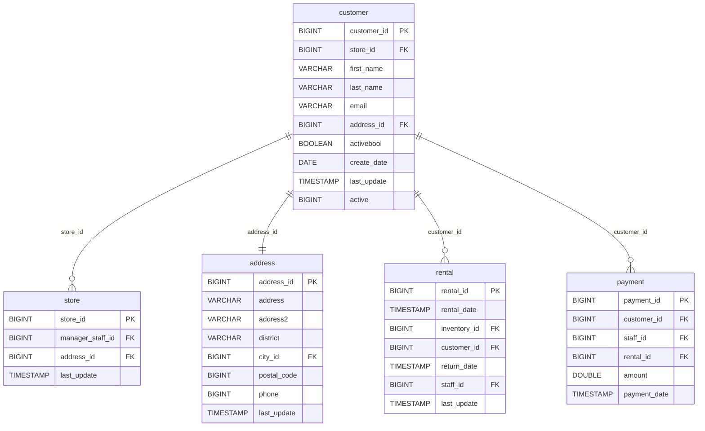

# Data Architecture Discovery: customer

**Analysis Date:** 2025-01-16  
**Domain:** dvd_rentals  
**Row Count:** 599

---

## 1. Primary Key Analysis

**Primary Key:** `customer_id`

**Justification:**
- Column `customer_id` has 599 distinct values matching the total row count (599)
- All values are unique (distinct_count = row_count)
- Sequential numeric identifier (BIGINT: 1 to 599)
- Core dimension representing customer entities

**Uniqueness Confidence:** ✅ High (100% unique)

---

## 2. Foreign Key Analysis

The `customer` table contains the following foreign key relationships:

| FK Column | References Table | References Column | Cardinality |
|-----------|------------------|-------------------|-------------|
| `store_id` | store | store_id | Many-to-One |
| `address_id` | address | address_id | One-to-One |

**Details:**
- **store_id**: 2 distinct values (1, 2) - indicates the customer's home/preferred store
- **address_id**: 599 distinct values - one-to-one relationship with address (each customer has unique address)

---

## 3. Orchestration Strategy

**Update Timestamp Column:** `last_update`

**Latest Dates (Top 10):**
- "2013-05-26 14:49:45.738000" (all 599 records)

**Additional Date Columns:**
- `create_date`: All customers created on "2006-02-14" (single batch load)

**Derived Orchestration Strategy:**
> A dimension table materialized with full-refresh strategy. All records share the same `last_update` timestamp ("2013-05-26 14:49:45.738000"), indicating a bulk update or migration. The uniform `create_date` suggests an initial batch load of customer data. This is a slowly changing dimension (SCD Type 1 based on single timestamp).

**Refresh Strategy:** Full refresh or SCD Type 1 merge based on `customer_id`

**Refresh Latency:** Infrequent updates (days/weeks) - dimension changes slowly

---

## 4. Entity Relationship Diagram

---

## 5. Business Context

**Table Purpose:** Customer dimension table containing demographic and contact information

**Key Metrics:**
- Total customers: 599
- Active customers: 584 (97.5%)
- Inactive customers: 15 (2.5%)
- Store distribution:
  - Store 1: ~326 customers (54.4%)
  - Store 2: ~273 customers (45.6%)

**Data Characteristics:**
- All customers have unique email addresses (599 distinct)
- 591 distinct first names (high variety)
- 599 distinct last names (complete uniqueness)
- All customers created on same date (initial load: 2006-02-14)

---

## 6. Data Quality Observations

✅ **Strengths:**
- Strong primary key integrity (100% unique)
- Complete customer information (no nulls in key fields)
- Unique email addresses (good for customer identification)
- One-to-one address relationship maintains data integrity

⚠️ **Potential Issues:**
- Dual active flags (`activebool` and `active`) - potential data redundancy
- Static timestamps indicate no recent customer updates since 2013
- Uniform create_date suggests bulk historical load rather than organic growth

---

## 7. Recommendations

1. **Data Modeling:** Core customer dimension in star schema
2. **Loading Strategy:** Implement SCD Type 2 to track customer changes over time (address changes, store transfers)
3. **Data Quality:** 
   - Reconcile `activebool` and `active` columns
   - Implement validation for email format
   - Add customer segmentation attributes
4. **Analytics:**
   - Track customer lifetime value by joining with rental/payment facts
   - Analyze customer retention and churn
   - Segment customers by store preference and activity
5. **Performance:** Index on `store_id` and `email` for common lookup patterns
