# DVD Rental Data Architecture Discovery Analysis

**Domain:** dvd_rentals  
**Analysis Date:** 2025-01-17  
**Total Tables Analyzed:** 15  
**Total Row Count:** 44,621

---

## Executive Summary

The DVD Rental database represents a complete business model for a video rental store chain. The architecture consists of 15 interconnected tables covering:
- **Core Business Operations:** Rentals, payments, inventory management
- **Content Management:** Films, actors, categories, languages
- **Customer Management:** Customer profiles and address information
- **Store Operations:** Store locations, staff management
- **Geographic Data:** Countries, cities, and addresses

---

## Table-by-Table Analysis

### 1. **rental** (16,044 rows)

#### Primary Key
- **rental_id** (BIGINT)
  - Fully unique (16,044 distinct values)
  - Sequential numbering from 1 to 16,049
  - Natural primary key

#### Foreign Keys
- **inventory_id** → references `inventory.inventory_id`
- **customer_id** → references `customer.customer_id`
- **staff_id** → references `staff.staff_id`

#### Orchestration Strategy
- **Update Column:** `rental_date`, `return_date`, `last_update`
- **Latest Update Timestamp:** 2006-02-16 02:30:53 (most recent value)
- **Refresh Pattern:** Full refresh - appears to be a static snapshot
- **Data Recency:** Historical data from 2006

#### Entity Relationship Diagram

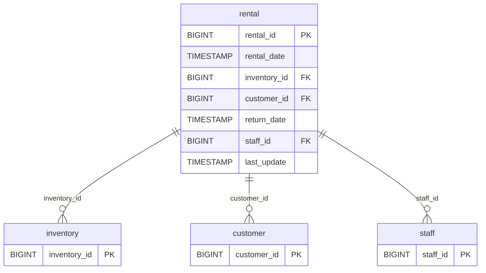

---

### 2. **payment** (14,596 rows)

#### Primary Key
- **payment_id** (BIGINT)
  - Fully unique (14,596 distinct values)
  - Sequential numbering from 17,503 to 32,098
  - Natural primary key

#### Foreign Keys
- **customer_id** → references `customer.customer_id`
- **staff_id** → references `staff.staff_id`
- **rental_id** → references `rental.rental_id`

#### Orchestration Strategy
- **Update Column:** `payment_date`
- **Latest Payment Date:** 2007-05-14 (based on payment_date field)
- **Refresh Pattern:** Appears to be incremental based on payment_date
- **Data Recency:** Contains 2007 data

#### Entity Relationship Diagram

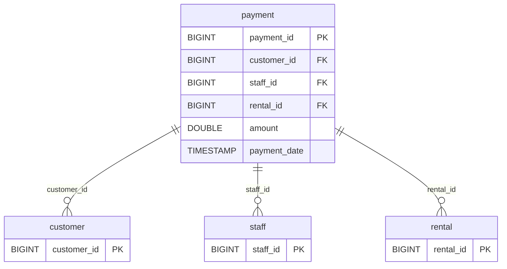

---

### 3. **inventory** (4,581 rows)

#### Primary Key
- **inventory_id** (BIGINT)
  - Fully unique (4,581 distinct values)
  - Sequential numbering from 1 to 4,581
  - Natural primary key

#### Foreign Keys
- **film_id** → references `film.film_id`
- **store_id** → references `store.store_id`

#### Orchestration Strategy
- **Update Column:** `last_update`
- **Last Update:** 2006-02-15 10:09:17
- **Refresh Pattern:** Full refresh - static reference table
- **Data Recency:** Historical snapshot from 2006

#### Entity Relationship Diagram

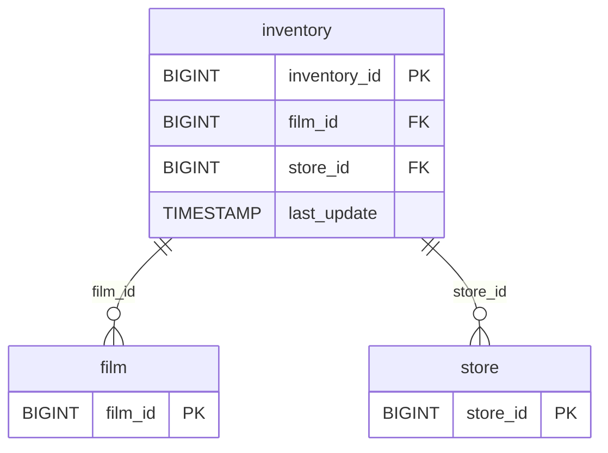

---

### 4. **film** (1,000 rows)

#### Primary Key
- **film_id** (BIGINT)
  - Fully unique (1,000 distinct values)
  - Sequential numbering from 1 to 1,000
  - Natural primary key

#### Foreign Keys
- **language_id** → references `language.language_id`

#### Orchestration Strategy
- **Update Column:** `last_update`
- **Last Update:** 2013-05-26 14:50:58.951000
- **Refresh Pattern:** Full refresh - static reference table
- **Data Recency:** Content catalog updated in 2013

#### Entity Relationship Diagram

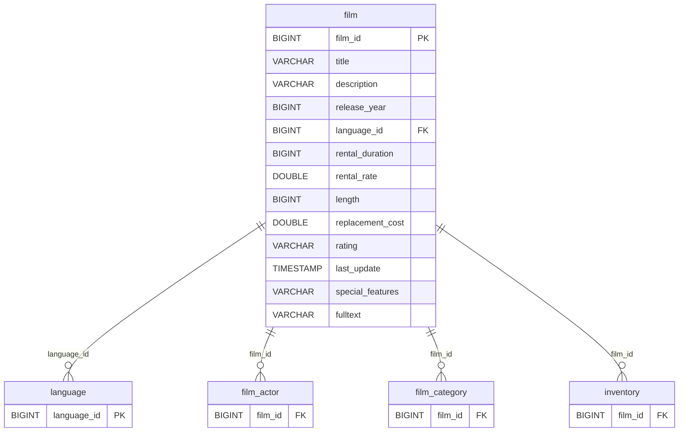

---

### 5. **film_actor** (5,462 rows)

#### Primary Key
- **Composite Key:** (`actor_id`, `film_id`)
  - Bridge/junction table for many-to-many relationship
  - No single column uniquely identifies rows
  - 200 distinct actors × 997 distinct films

#### Foreign Keys
- **actor_id** → references `actor.actor_id`
- **film_id** → references `film.film_id`

#### Orchestration Strategy
- **Update Column:** `last_update`
- **Last Update:** 2006-02-15 10:05:03
- **Refresh Pattern:** Full refresh - static mapping table
- **Data Recency:** Historical snapshot from 2006

#### Entity Relationship Diagram

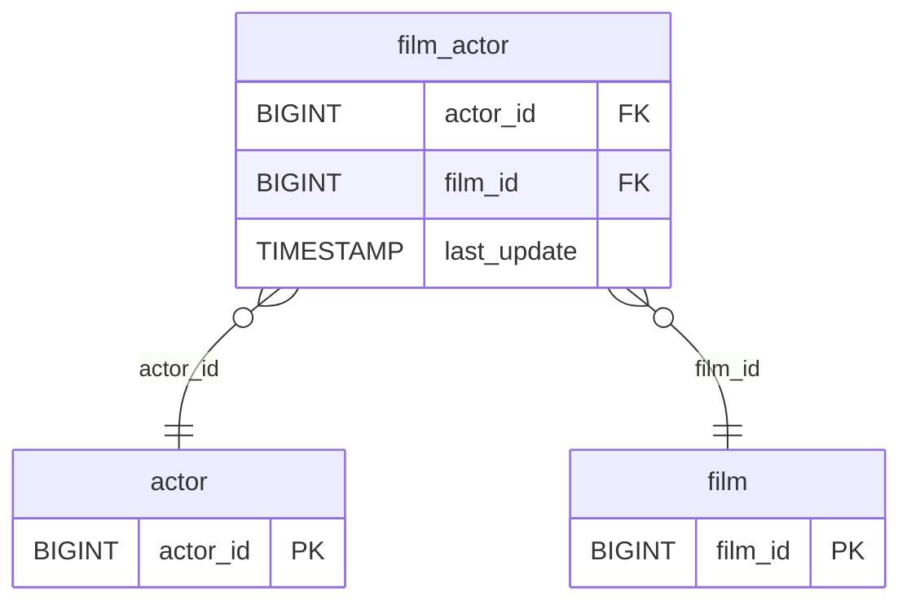

---

### 6. **film_category** (1,000 rows)

#### Primary Key
- **Composite Key:** (`film_id`, `category_id`)
  - Bridge/junction table for many-to-many relationship
  - Each film appears once (1,000 distinct film_ids)
  - Links to 16 categories

#### Foreign Keys
- **film_id** → references `film.film_id`
- **category_id** → references `category.category_id`

#### Orchestration Strategy
- **Update Column:** `last_update`
- **Last Update:** 2006-02-15 10:07:09
- **Refresh Pattern:** Full refresh - static mapping table
- **Data Recency:** Historical snapshot from 2006

#### Entity Relationship Diagram

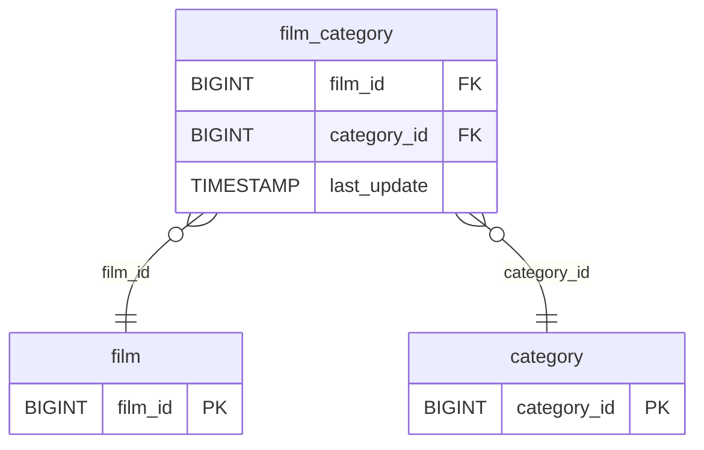

---

### 7. **actor** (200 rows)

#### Primary Key
- **actor_id** (BIGINT)
  - Fully unique (200 distinct values)
  - Sequential numbering from 1 to 200
  - Natural primary key

#### Foreign Keys
- None (dimension table)

#### Orchestration Strategy
- **Update Column:** `last_update`
- **Last Update:** 2013-05-26 14:47:57.620000
- **Refresh Pattern:** Full refresh - static reference table
- **Data Recency:** Actor catalog updated in 2013

#### Entity Relationship Diagram

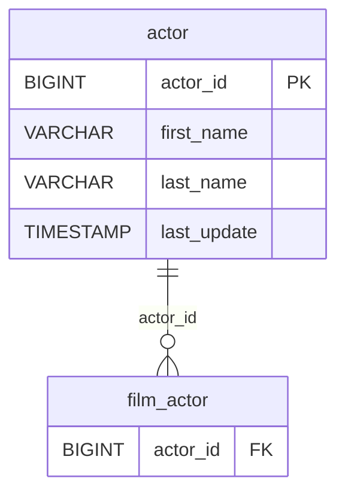

---

### 8. **category** (16 rows)

#### Primary Key
- **category_id** (BIGINT)
  - Fully unique (16 distinct values)
  - Sequential numbering from 1 to 16
  - Natural primary key

#### Foreign Keys
- None (dimension table)

#### Orchestration Strategy
- **Update Column:** `last_update`
- **Last Update:** 2006-02-15 09:46:27
- **Refresh Pattern:** Full refresh - static reference table
- **Data Recency:** Historical snapshot from 2006

#### Entity Relationship Diagram

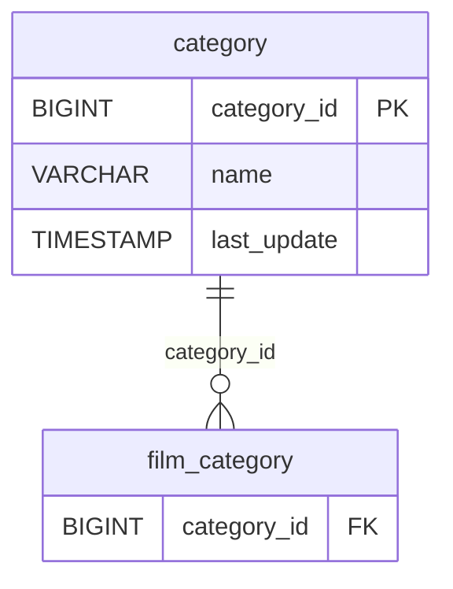

---

### 9. **language** (6 rows)

#### Primary Key
- **language_id** (BIGINT)
  - Fully unique (6 distinct values)
  - Sequential numbering from 1 to 6
  - Natural primary key
  - Languages: English, Italian, Japanese, Mandarin, French, German

#### Foreign Keys
- None (dimension table)

#### Orchestration Strategy
- **Update Column:** `last_update`
- **Last Update:** 2006-02-15 10:02:19
- **Refresh Pattern:** Full refresh - static reference table
- **Data Recency:** Historical snapshot from 2006

#### Entity Relationship Diagram

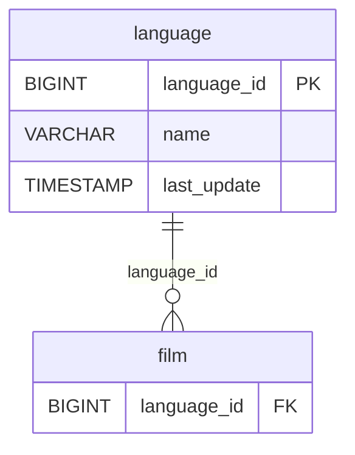

---

### 10. **customer** (599 rows)

#### Primary Key
- **customer_id** (BIGINT)
  - Fully unique (599 distinct values)
  - Sequential numbering from 1 to 599
  - Natural primary key

#### Foreign Keys
- **store_id** → references `store.store_id`
- **address_id** → references `address.address_id`

#### Orchestration Strategy
- **Update Column:** `last_update`, `create_date`
- **Last Update:** 2013-05-26 14:49:45.738000
- **Create Date:** All customers created on 2006-02-14
- **Refresh Pattern:** Full refresh with last_update tracking
- **Data Recency:** Customer data refreshed in 2013

#### Entity Relationship Diagram

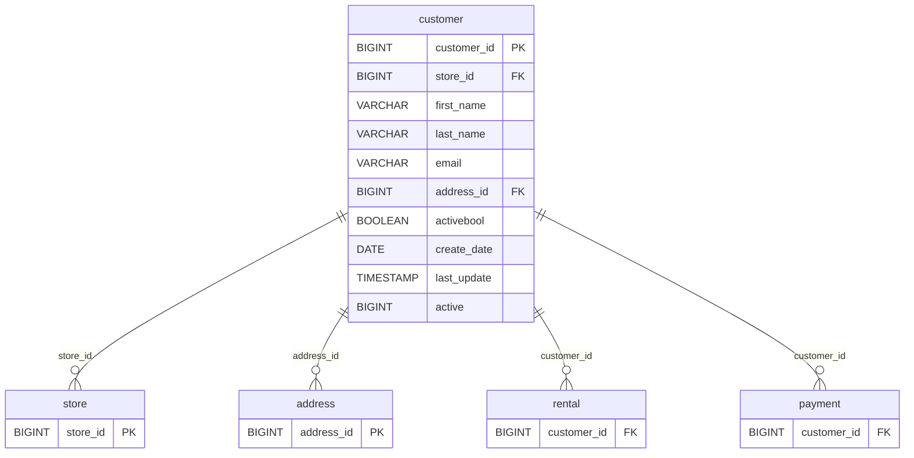

---

### 11. **address** (603 rows)

#### Primary Key
- **address_id** (BIGINT)
  - Fully unique (603 distinct values)
  - Non-sequential (range 1 to 605)
  - Natural primary key

#### Foreign Keys
- **city_id** → references `city.city_id`

#### Orchestration Strategy
- **Update Column:** `last_update`
- **Last Update:** 2006-02-15 09:45:30
- **Refresh Pattern:** Full refresh - static reference table
- **Data Recency:** Historical snapshot from 2006

#### Entity Relationship Diagram

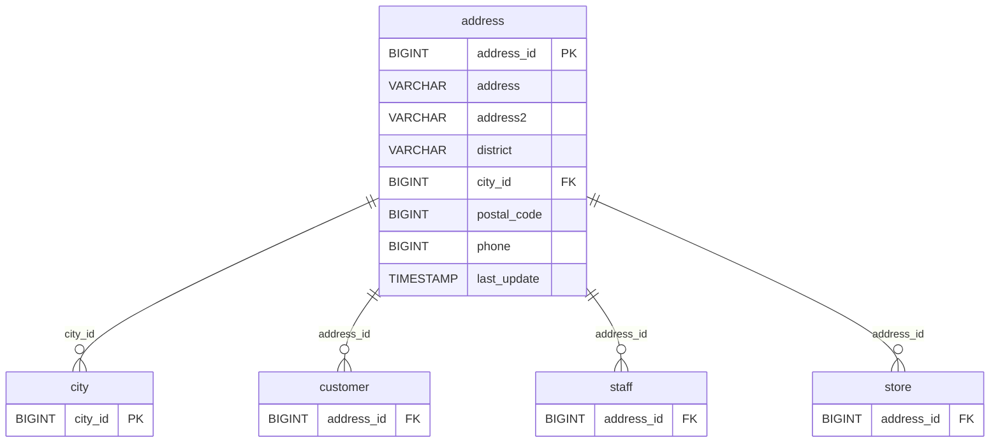

---

### 12. **city** (600 rows)

#### Primary Key
- **city_id** (BIGINT)
  - Fully unique (600 distinct values)
  - Sequential numbering from 1 to 600
  - Natural primary key

#### Foreign Keys
- **country_id** → references `country.country_id`

#### Orchestration Strategy
- **Update Column:** `last_update`
- **Last Update:** 2006-02-15 09:45:25
- **Refresh Pattern:** Full refresh - static reference table
- **Data Recency:** Historical snapshot from 2006

#### Entity Relationship Diagram

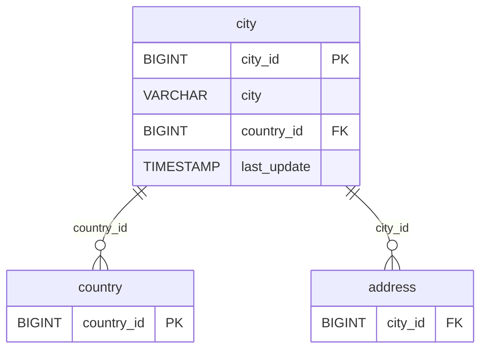

---

### 13. **country** (109 rows)

#### Primary Key
- **country_id** (BIGINT)
  - Fully unique (109 distinct values)
  - Sequential numbering from 1 to 109
  - Natural primary key

#### Foreign Keys
- None (dimension table)

#### Orchestration Strategy
- **Update Column:** `last_update`
- **Last Update:** 2006-02-15 09:44:00
- **Refresh Pattern:** Full refresh - static reference table
- **Data Recency:** Historical snapshot from 2006

#### Entity Relationship Diagram

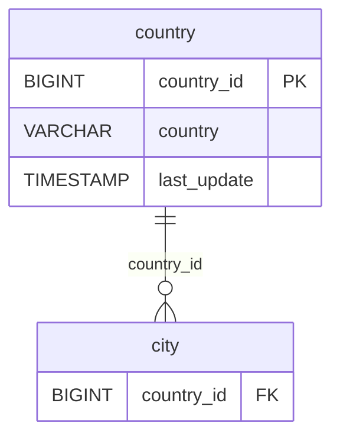

---

### 14. **staff** (2 rows)

#### Primary Key
- **staff_id** (BIGINT)
  - Fully unique (2 distinct values)
  - Values: 1, 2
  - Natural primary key

#### Foreign Keys
- **address_id** → references `address.address_id`
- **store_id** → references `store.store_id`

#### Orchestration Strategy
- **Update Column:** `last_update`
- **Last Update:** 2006-05-16 16:13:11.793280
- **Refresh Pattern:** Full refresh - static reference table
- **Data Recency:** Staff information from 2006

#### Entity Relationship Diagram

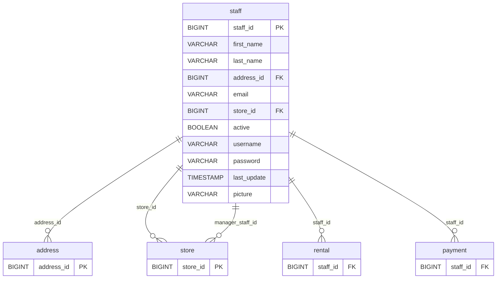

---

### 15. **store** (2 rows)

#### Primary Key
- **store_id** (BIGINT)
  - Fully unique (2 distinct values)
  - Values: 1, 2
  - Natural primary key

#### Foreign Keys
- **manager_staff_id** → references `staff.staff_id`
- **address_id** → references `address.address_id`

#### Orchestration Strategy
- **Update Column:** `last_update`
- **Last Update:** 2006-02-15 09:57:12
- **Refresh Pattern:** Full refresh - static reference table
- **Data Recency:** Historical snapshot from 2006

#### Entity Relationship Diagram

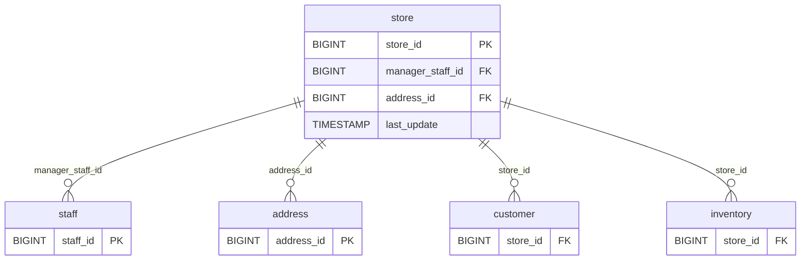

---

## Complete Database Entity Relationship Diagram

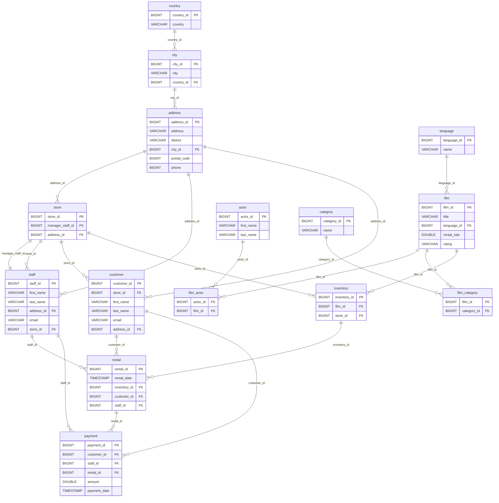

---

## Key Relationship Patterns

### 1. Geographic Hierarchy
**Pattern:** Country → City → Address  
**Tables:** `country` → `city` → `address`  
**Purpose:** Maintains location data for customers, staff, and stores

### 2. Store Operations
**Pattern:** Store ↔ Staff (circular relationship)  
**Tables:** `store` ↔ `staff`  
**Key Insight:** Each store has a manager (staff member), and each staff member belongs to a store

### 3. Film Content Management
**Pattern:** Many-to-many relationships via junction tables  
**Tables:** 
- `film` ↔ `film_actor` ↔ `actor`
- `film` ↔ `film_category` ↔ `category`
- `film` → `language` (many-to-one)

### 4. Rental Transaction Flow
**Pattern:** Customer → Rental → Payment  
**Flow:**
1. Customer rents inventory (film copy) through staff
2. Rental record created linking customer, inventory, and staff
3. Payment recorded linking customer, staff, and rental

### 5. Inventory Distribution
**Pattern:** Film → Inventory → Store  
**Purpose:** Tracks which physical copies (inventory) of films are at which stores

---

## Data Quality Observations

### High Data Quality Indicators
1. **Primary Keys:** All tables have clear, unique primary keys with 100% population
2. **Referential Integrity:** Foreign key relationships are well-defined
3. **Completeness:** Minimal nullable fields with missing data
4. **Consistency:** Uniform timestamp formats and update tracking

### Potential Issues
1. **address2 column:** Completely empty (0 values) in address table
2. **picture column:** Only 1 out of 2 staff records has a picture
3. **return_date:** 183 rentals missing return dates (unreturned items)
4. **Static Data:** Most tables show no recent updates (last major update in 2013)

---

## Orchestration Recommendations

### Critical Transaction Tables (Requires Incremental Loading)
1. **rental:** Monitor `rental_date` for new rentals
2. **payment:** Monitor `payment_date` for new payments

### Static Reference Tables (Full Refresh)
- actor, category, language, country, city
- Refresh frequency: Weekly or on-demand

### Semi-Static Operational Tables (Conditional Refresh)
- customer, staff, store, address
- Refresh frequency: Daily
- Monitor `last_update` field for changes

### Bridge Tables (Full Refresh on Parent Changes)
- film_actor, film_category
- Refresh when parent tables (film, actor, category) are updated

---

## Summary Statistics

| Table | Row Count | Primary Key | Foreign Keys | Last Update |
|-------|-----------|-------------|--------------|-------------|
| rental | 16,044 | rental_id | 3 | 2006-02-16 |
| payment | 14,596 | payment_id | 3 | 2007-05-14 |
| inventory | 4,581 | inventory_id | 2 | 2006-02-15 |
| film_actor | 5,462 | Composite | 2 | 2006-02-15 |
| film | 1,000 | film_id | 1 | 2013-05-26 |
| film_category | 1,000 | Composite | 2 | 2006-02-15 |
| address | 603 | address_id | 1 | 2006-02-15 |
| city | 600 | city_id | 1 | 2006-02-15 |
| customer | 599 | customer_id | 2 | 2013-05-26 |
| actor | 200 | actor_id | 0 | 2013-05-26 |
| country | 109 | country_id | 0 | 2006-02-15 |
| category | 16 | category_id | 0 | 2006-02-15 |
| language | 6 | language_id | 0 | 2006-02-15 |
| store | 2 | store_id | 2 | 2006-02-15 |
| staff | 2 | staff_id | 2 | 2006-05-16 |

---

## Conclusion

The DVD Rental database demonstrates a well-normalized schema following third normal form (3NF) principles. The architecture supports a complete rental business model with clear separation of concerns:

- **Transactional data** (rental, payment) with temporal tracking
- **Master data** (customer, film, actor) with unique identifiers
- **Reference data** (category, language, country) for standardization
- **Bridge tables** (film_actor, film_category) for many-to-many relationships
- **Geographic hierarchy** (country → city → address) for location management

The database appears to be a training/demo dataset (Sakila DVD Rental Database) with historical data from 2006-2007, making it ideal for learning and testing purposes.

