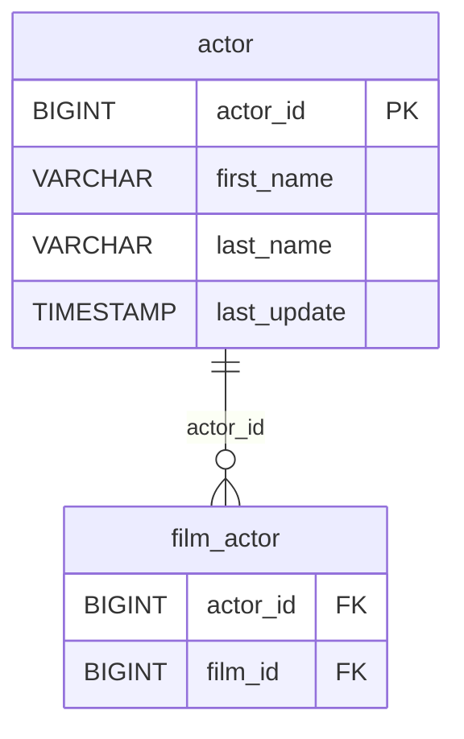

# Discovery Analysis — `actor`
**Domain:** dvd_rentals
**Generated at:** 2026-05-16

---

## Overview

| Property  | Value   |
|-----------|---------|
| Table     | `actor` |
| Row Count | 200     |

---

## 1. Primary Key

| Column     | Type   | Distinct Count | Notes                       |
|------------|--------|----------------|-----------------------------|
| `actor_id` | BIGINT | 200            | Fully unique — confirmed PK |

✅ `actor_id` is the Primary Key. Its distinct count matches the row count exactly.

> ℹ️ Note: `first_name` (128 unique) and `last_name` (121 unique) are NOT unique on their own, confirming `actor_id` as the natural key.

---

## 2. Foreign Keys

No foreign key columns detected in this table.

---

## 3. Orchestration

| Column        | Type      | Observed Values                            |
|---------------|-----------|---------------------------------------------|
| `last_update` | TIMESTAMP | `2013-05-26 14:47:57.620000` (all 200 rows) |

**Strategy:** All rows share the same `last_update` timestamp from 2013, while the base data appears from the 2006 dataset era. This suggests a **bulk data migration or schema refresh** at some point. No recurring update pattern detected.

> 📌 Hypothesis: Full-refresh reference table. Actor catalog — low change frequency. Safe to reload entirely on each run.

---

## 4. Relationships (ERD)

