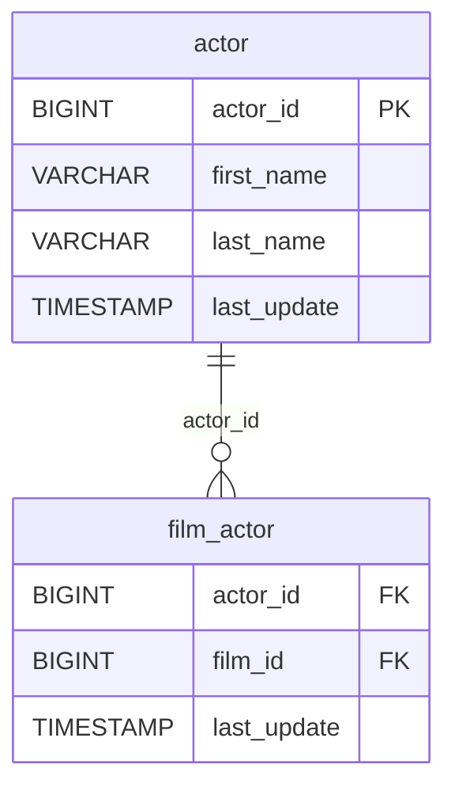

# 🎬 Discovery Analysis — `actor`
**Domain:** dvd_rentals
**Generated at:** 2026-05-16 20:59 UTC

---

## 1. Table Overview

| Property | Value |
|----------|-------|
| Table Name | `actor` |
| Row Count | 200 |
| Columns | 4 |

---

## 2. Primary Key

| Column | Type | Distinct Count | Rationale |
|--------|------|---------------|-----------|
| `actor_id` | BIGINT | 200 | Fully unique across all 200 rows. Sequential integer. Confirmed PK. |

---

## 3. Foreign Keys

No foreign key columns detected in this table.

---

## 4. Orchestration

| Property | Detail |
|----------|--------|
| Update Timestamp Column | `last_update` |
| Latest Date Observed | `2013-05-26 14:47:57.620000` |
| Distinct Dates | 1 — all rows share the same timestamp |
| Strategy Hypothesis | **Static reference table.** All rows have an identical `last_update` value, indicating a single bulk load or one-time snapshot. No incremental activity is detectable. Likely refreshed via full-replace on a low-frequency schedule (e.g., weekly or on-demand). |

---

## 5. Relationships

### Outgoing FKs (from `actor` to other tables)
_None._

### Incoming FKs (other tables referencing `actor`)

| Referencing Table | FK Column | Relationship |
|-------------------|-----------|--------------|
| `film_actor` | `actor_id` | Many actors participate in many films via `film_actor` bridge |

---

## 6. Entity-Relationship Diagram

