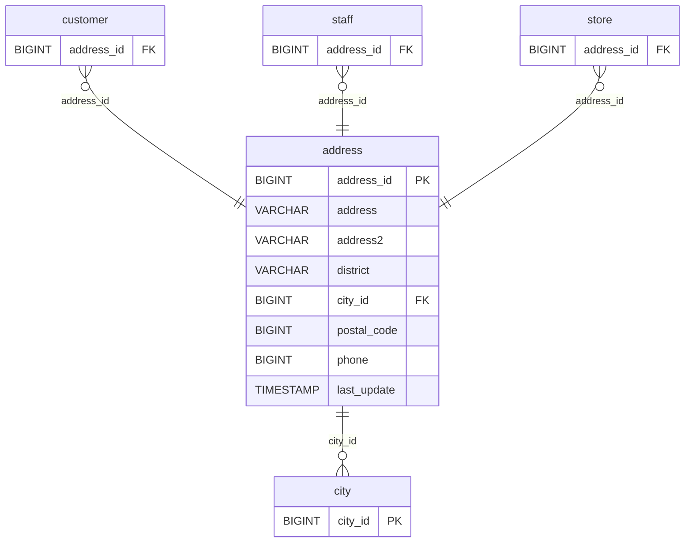

# Discovery Analysis — `address`
**Domain:** dvd_rentals
**Generated at:** 2026-05-16

---

## Overview

| Property  | Value     |
|-----------|-----------|
| Table     | `address` |
| Row Count | 603       |

---

## 1. Primary Key

| Column       | Type   | Distinct Count | Notes                        |
|--------------|--------|----------------|------------------------------|
| `address_id` | BIGINT | 603            | Fully unique — confirmed PK  |

✅ `address_id` is the Primary Key. Its distinct count matches the row count exactly.

> ℹ️ Note: `address` (street text) also has 603 unique values, confirming the addresses are all physically distinct. `address2` is entirely null (count = 0).

---

## 2. Foreign Keys

| Column    | References Table | References Column | Notes                                      |
|-----------|------------------|-------------------|--------------------------------------------|
| `city_id` | `city`           | `city_id`         | 599 distinct values out of 600 city IDs    |

---

## 3. Orchestration

| Column        | Type      | Observed Values                           |
|---------------|-----------|-------------------------------------------|
| `last_update` | TIMESTAMP | `2006-02-15 09:45:30` (all 603 rows)      |

**Strategy:** All rows share a single `last_update` value, indicating a **static reference table** loaded once. No incremental updates expected.

> 📌 Hypothesis: Full-refresh reference table. Address master data — low change frequency. Safe to reload entirely on each run.

---

## 4. Relationships (ERD)

