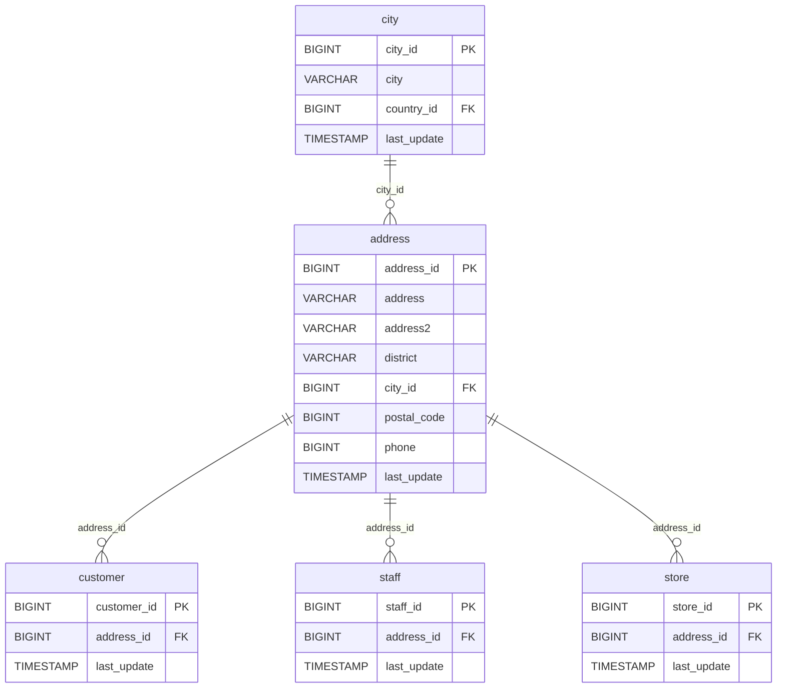

# 🏠 Discovery Analysis — `address`
**Domain:** dvd_rentals
**Generated at:** 2026-05-16 20:59 UTC

---

## 1. Table Overview

| Property | Value |
|----------|-------|
| Table Name | `address` |
| Row Count | 603 |
| Columns | 8 |

---

## 2. Primary Key

| Column | Type | Distinct Count | Rationale |
|--------|------|---------------|-----------|
| `address_id` | BIGINT | 603 | Fully unique across all 603 rows. Max value is 605 (sparse), indicating sequential auto-increment with minor deletions. Confirmed PK. |

---

## 3. Foreign Keys

| Column | Type | Distinct Count | References |
|--------|------|---------------|------------|
| `city_id` | BIGINT | 599 | → `city.city_id` — each address belongs to a city |

---

## 4. Orchestration

| Property | Detail |
|----------|--------|
| Update Timestamp Column | `last_update` |
| Latest Date Observed | `2006-02-15 09:45:30` |
| Distinct Dates | 1 — all rows share the same timestamp |
| Strategy Hypothesis | **Static reference table.** All rows share a single `last_update` value, consistent with a one-time bulk snapshot. No evidence of incremental updates. Likely refreshed on-demand or full-replace on a low cadence. |

---

## 5. Relationships

### Outgoing FKs (from `address` to other tables)

| FK Column | References | Relationship |
|-----------|------------|--------------|
| `city_id` | `city.city_id` | Each address belongs to one city |

### Incoming FKs (other tables referencing `address`)

| Referencing Table | FK Column | Relationship |
|-------------------|-----------|--------------|
| `customer` | `address_id` | Each customer has one address |
| `staff` | `address_id` | Each staff member has one address |
| `store` | `address_id` | Each store has one address |

---

## 6. Entity-Relationship Diagram

