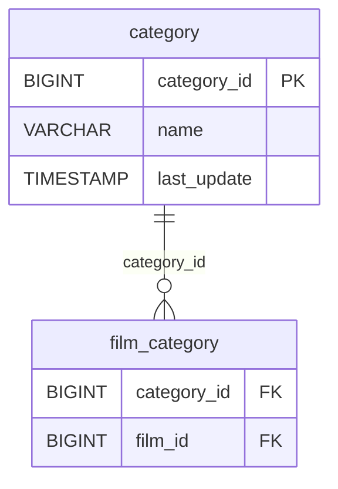

# Discovery Analysis — `category`
**Domain:** dvd_rentals
**Generated at:** 2026-05-16

---

## Overview

| Property  | Value      |
|-----------|------------|
| Table     | `category` |
| Row Count | 16         |

---

## 1. Primary Key

| Column        | Type   | Distinct Count | Notes                       |
|---------------|--------|----------------|-----------------------------|
| `category_id` | BIGINT | 16             | Fully unique — confirmed PK |

✅ `category_id` is the Primary Key. Its distinct count matches the row count exactly.

**Category values:** Action, Animation, Children, Classics, Comedy, Documentary, Drama, Family, Foreign, Games, Horror, Music, New, Sci-Fi, Sports, Travel.

---

## 2. Foreign Keys

No foreign key columns detected in this table.

---

## 3. Orchestration

| Column        | Type      | Observed Values                         |
|---------------|-----------|------------------------------------------|
| `last_update` | TIMESTAMP | `2006-02-15 09:46:27` (all 16 rows)     |

**Strategy:** All rows share a single `last_update` timestamp. This is a **static genre/classification lookup table** with only 16 rows. Expected to be loaded via **full-refresh**.

> 📌 Hypothesis: Full-refresh lookup table. Film genre categories — extremely static. Safe to reload entirely on each run with minimal cost.

---

## 4. Relationships (ERD)

