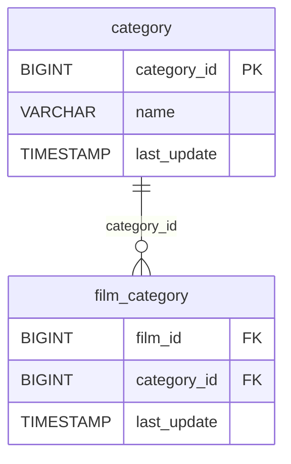

# 🗂️ Discovery Analysis — `category`
**Domain:** dvd_rentals
**Generated at:** 2026-05-16 20:59 UTC

---

## 1. Table Overview

| Property | Value |
|----------|-------|
| Table Name | `category` |
| Row Count | 16 |
| Columns | 3 |

---

## 2. Primary Key

| Column | Type | Distinct Count | Rationale |
|--------|------|---------------|-----------|
| `category_id` | BIGINT | 16 | Fully unique across all 16 rows. Values range from 1 to 16. Confirmed PK. |

---

## 3. Foreign Keys

No foreign key columns detected in this table.

---

## 4. Orchestration

| Property | Detail |
|----------|--------|
| Update Timestamp Column | `last_update` |
| Latest Date Observed | `2006-02-15 09:46:27` |
| Distinct Dates | 1 — all rows share the same timestamp |
| Strategy Hypothesis | **Static reference / lookup table.** Only 16 rows and a single shared `last_update`, strongly indicating a one-time load. Categories (Action, Comedy, Drama, etc.) are rarely modified. Likely full-replace on-demand only. |

---

## 5. Relationships

### Outgoing FKs (from `category` to other tables)
_None._

### Incoming FKs (other tables referencing `category`)

| Referencing Table | FK Column | Relationship |
|-------------------|-----------|--------------|
| `film_category` | `category_id` | Each film is tagged with a category through this bridge |

---

## 6. Entity-Relationship Diagram

