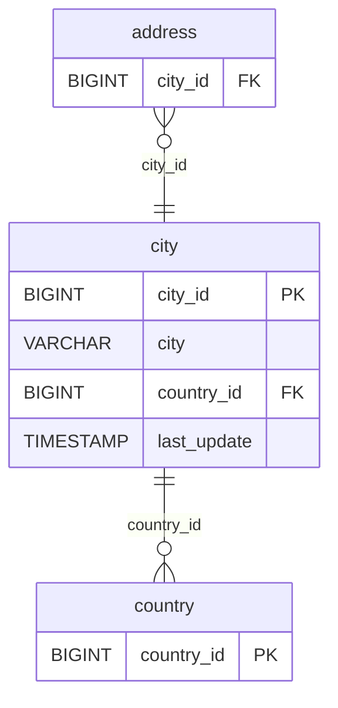

# Discovery Analysis — `city`
**Domain:** dvd_rentals
**Generated at:** 2026-05-16

---

## Overview

| Property  | Value  |
|-----------|--------|
| Table     | `city` |
| Row Count | 600    |

---

## 1. Primary Key

| Column    | Type   | Distinct Count | Notes                       |
|-----------|--------|----------------|-----------------------------|
| `city_id` | BIGINT | 600            | Fully unique — confirmed PK |

✅ `city_id` is the Primary Key. Its distinct count matches the row count exactly.

> ⚠️ Note: The `city` column has 599 unique values (one duplicate: "London"), confirming `city_id` as the true unique identifier.

---

## 2. Foreign Keys

| Column       | References Table | References Column | Notes                                      |
|--------------|------------------|-------------------|--------------------------------------------|
| `country_id` | `country`        | `country_id`      | 109 distinct values matching country table |

---

## 3. Orchestration

| Column        | Type      | Observed Values                           |
|---------------|-----------|-------------------------------------------|
| `last_update` | TIMESTAMP | `2006-02-15 09:45:25` (all 600 rows)      |

**Strategy:** All rows share a single `last_update` value, indicating a **static geographic reference table** loaded once. No incremental updates expected.

> 📌 Hypothesis: Full-refresh reference table. Geographic data — low change frequency. Safe to reload entirely on each run.

---

## 4. Relationships (ERD)

