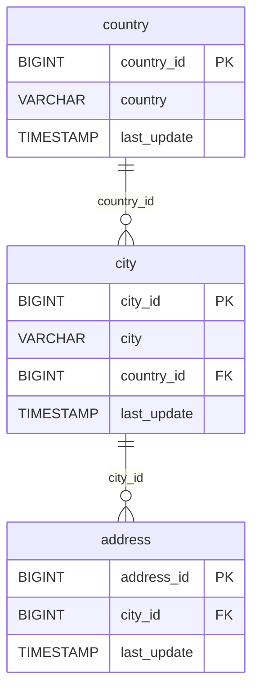

# 🏙️ Discovery Analysis — `city`
**Domain:** dvd_rentals
**Generated at:** 2026-05-16 20:59 UTC

---

## 1. Table Overview

| Property | Value |
|----------|-------|
| Table Name | `city` |
| Row Count | 600 |
| Columns | 4 |

---

## 2. Primary Key

| Column | Type | Distinct Count | Rationale |
|--------|------|---------------|-----------|
| `city_id` | BIGINT | 600 | Fully unique across all 600 rows. Sequential integers from 1 to 600. Confirmed PK. |

> ⚠️ **Note:** The `city` name column has 599 distinct values (1 duplicate — "London"). Therefore `city` alone is not a reliable natural key.

---

## 3. Foreign Keys

| Column | Type | Distinct Count | References |
|--------|------|---------------|------------|
| `country_id` | BIGINT | 109 | → `country.country_id` — each city belongs to a country |

---

## 4. Orchestration

| Property | Detail |
|----------|--------|
| Update Timestamp Column | `last_update` |
| Latest Date Observed | `2006-02-15 09:45:25` |
| Distinct Dates | 1 — all 600 rows share the same timestamp |
| Strategy Hypothesis | **Static reference table.** Single bulk load, no incremental activity. Likely refreshed full-replace on-demand or very low frequency. |

---

## 5. Relationships

### Outgoing FKs (from `city` to other tables)

| FK Column | References | Relationship |
|-----------|------------|--------------|
| `country_id` | `country.country_id` | Each city belongs to one country |

### Incoming FKs (other tables referencing `city`)

| Referencing Table | FK Column | Relationship |
|-------------------|-----------|--------------|
| `address` | `city_id` | Each address is located in a city |

---

## 6. Entity-Relationship Diagram

