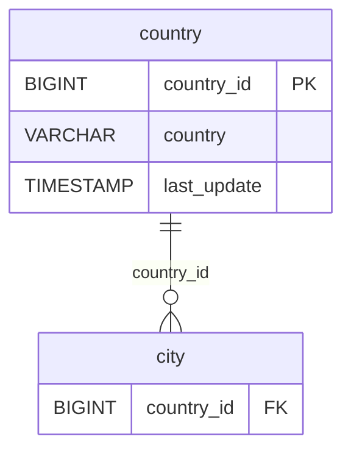

# Discovery Analysis — `country`
**Domain:** dvd_rentals
**Generated at:** 2026-05-16

---

## Overview

| Property  | Value     |
|-----------|-----------|
| Table     | `country` |
| Row Count | 109       |

---

## 1. Primary Key

| Column       | Type   | Distinct Count | Notes                       |
|--------------|--------|----------------|-----------------------------|
| `country_id` | BIGINT | 109            | Fully unique — confirmed PK |

✅ `country_id` is the Primary Key. Its distinct count matches the row count exactly.

> ℹ️ Note: The `country` name column is also fully unique (109 distinct values), making it a valid natural key.

---

## 2. Foreign Keys

No foreign key columns detected in this table. `country` is the root of the geographic hierarchy.

---

## 3. Orchestration

| Column        | Type      | Observed Values                           |
|---------------|-----------|-------------------------------------------|
| `last_update` | TIMESTAMP | `2006-02-15 09:44:00` (all 109 rows)      |

**Strategy:** All rows share a single `last_update` timestamp from 2006, indicating a **static geographic reference table** loaded once.

> 📌 Hypothesis: Full-refresh reference table. Country list — extremely low change frequency. Root of the geographic hierarchy (country → city → address). Safe to reload entirely on each run.

---

## 4. Relationships (ERD)

