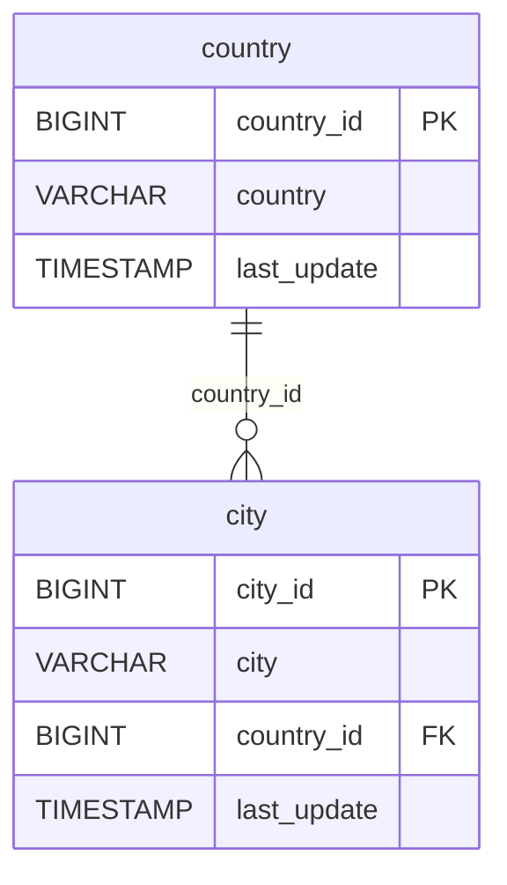

# 🌍 Discovery Analysis — `country`
**Domain:** dvd_rentals
**Generated at:** 2026-05-16 20:59 UTC

---

## 1. Table Overview

| Property | Value |
|----------|-------|
| Table Name | `country` |
| Row Count | 109 |
| Columns | 3 |

---

## 2. Primary Key

| Column | Type | Distinct Count | Rationale |
|--------|------|---------------|-----------|
| `country_id` | BIGINT | 109 | Fully unique across all 109 rows. Values range 1–109. Confirmed PK. |
| `country` | VARCHAR | 109 | Also fully unique — could serve as a natural key, but `country_id` is the surrogate PK. |

---

## 3. Foreign Keys

No foreign key columns detected in this table.

---

## 4. Orchestration

| Property | Detail |
|----------|--------|
| Update Timestamp Column | `last_update` |
| Latest Date Observed | `2006-02-15 09:44:00` |
| Distinct Dates | 1 — all rows share the same timestamp |
| Strategy Hypothesis | **Static top-level reference table.** Only 109 rows, single shared `last_update`. Countries are virtually immutable. Likely loaded once and refreshed only on structural changes (on-demand full-replace). |

---

## 5. Relationships

### Outgoing FKs (from `country` to other tables)
_None. This is a top-level root entity._

### Incoming FKs (other tables referencing `country`)

| Referencing Table | FK Column | Relationship |
|-------------------|-----------|--------------|
| `city` | `country_id` | Each city belongs to a country |

---

## 6. Entity-Relationship Diagram

