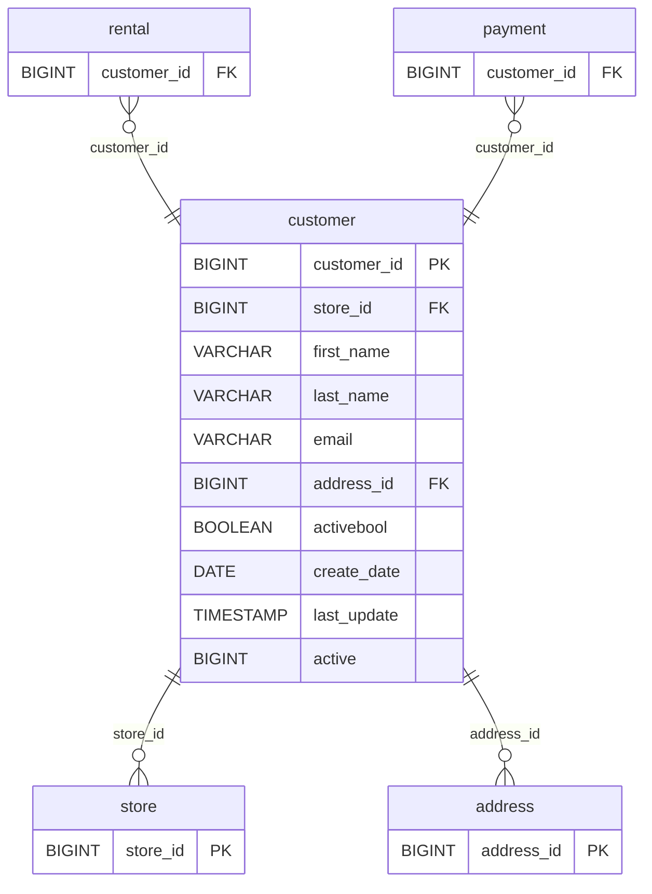

# Discovery Analysis — `customer`
**Domain:** dvd_rentals
**Generated at:** 2026-05-16

---

## Overview

| Property  | Value      |
|-----------|------------|
| Table     | `customer` |
| Row Count | 599        |

---

## 1. Primary Key

| Column        | Type   | Distinct Count | Notes                       |
|---------------|--------|----------------|-----------------------------|
| `customer_id` | BIGINT | 599            | Fully unique — confirmed PK |

✅ `customer_id` is the Primary Key. Its distinct count matches the row count exactly.

> ℹ️ Note: `last_name` is also fully unique (599 distinct), and `email` is fully unique — both could act as natural business keys. However, `customer_id` is the surrogate PK.

---

## 2. Foreign Keys

| Column       | References Table | References Column | Notes                                      |
|--------------|------------------|-------------------|--------------------------------------------|
| `store_id`   | `store`          | `store_id`        | Values [1, 2] — customers belong to a store|
| `address_id` | `address`        | `address_id`      | 599 distinct values — one address per customer|

---

## 3. Orchestration

| Column          | Type      | Observed Values                               |
|-----------------|-----------|-----------------------------------------------|
| `last_update`   | TIMESTAMP | `2013-05-26 14:49:45.738000` (all 599 rows)   |
| `create_date`   | DATE      | `2006-02-14` (all 599 rows)                   |

**Strategy:** All customers share the same `create_date` (2006-02-14) and `last_update` (2013 bulk refresh), suggesting the customer base was created in a single batch load. No evidence of row-level incremental updates.

> 📌 Hypothesis: Full-refresh table. Customer master data — low change frequency in this dataset. In production, this could support incremental updates using `last_update` as a watermark for SCD Type 1 or Type 2 patterns.

---

## 4. Relationships (ERD)

