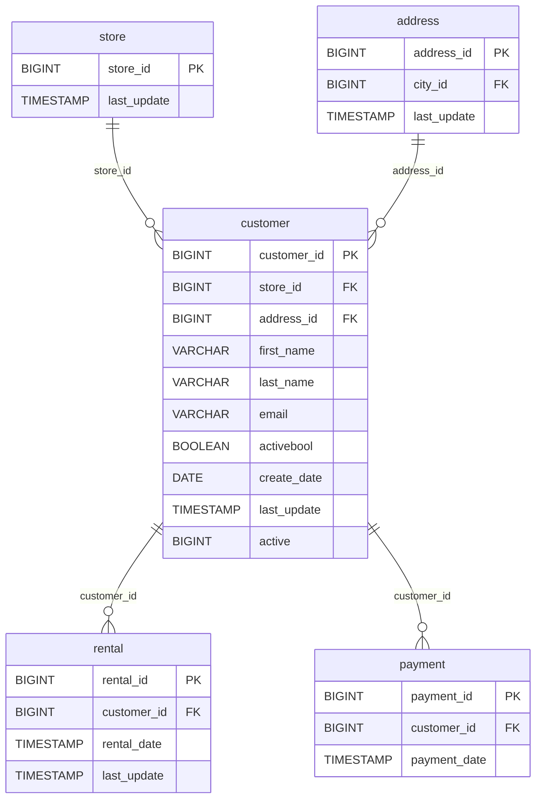

# 👤 Discovery Analysis — `customer`
**Domain:** dvd_rentals
**Generated at:** 2026-05-16 20:59 UTC

---

## 1. Table Overview

| Property | Value |
|----------|-------|
| Table Name | `customer` |
| Row Count | 599 |
| Columns | 10 |

---

## 2. Primary Key

| Column | Type | Distinct Count | Rationale |
|--------|------|---------------|-----------|
| `customer_id` | BIGINT | 599 | Fully unique across all 599 rows. Max value is 599, sequential integers. Confirmed PK. |

> ⚠️ **Note:** `email` also has 599 distinct values and could serve as a natural unique key. `last_name` alone is unique (599/599), but `first_name` is not (591 distinct). Both `email` and `last_name` could form alternate keys, though `customer_id` is the surrogate PK.

---

## 3. Foreign Keys

| Column | Type | Distinct Count | References |
|--------|------|---------------|------------|
| `store_id` | BIGINT | 2 | → `store.store_id` — the store where the customer is registered |
| `address_id` | BIGINT | 599 | → `address.address_id` — the customer's physical address |

---

## 4. Orchestration

| Property | Detail |
|----------|--------|
| Update Timestamp Column | `last_update` |
| Latest Date Observed | `2013-05-26 14:49:45.738000` |
| Distinct Dates | 1 — all 599 rows share the same timestamp |
| Strategy Hypothesis | **Static snapshot materialized as a table.** All rows carry the identical `last_update`, consistent with a full-refresh on a low-frequency schedule. The `create_date` column (`2006-02-14` for all rows) further confirms a one-time bulk load. Likely full-replace daily or on-demand. |

---

## 5. Relationships

### Outgoing FKs (from `customer` to other tables)

| FK Column | References | Relationship |
|-----------|------------|--------------|
| `store_id` | `store.store_id` | Customer is registered at one store |
| `address_id` | `address.address_id` | Customer has one address |

### Incoming FKs (other tables referencing `customer`)

| Referencing Table | FK Column | Relationship |
|-------------------|-----------|--------------|
| `rental` | `customer_id` | A customer can make many rentals |
| `payment` | `customer_id` | A customer can make many payments |

---

## 6. Entity-Relationship Diagram

