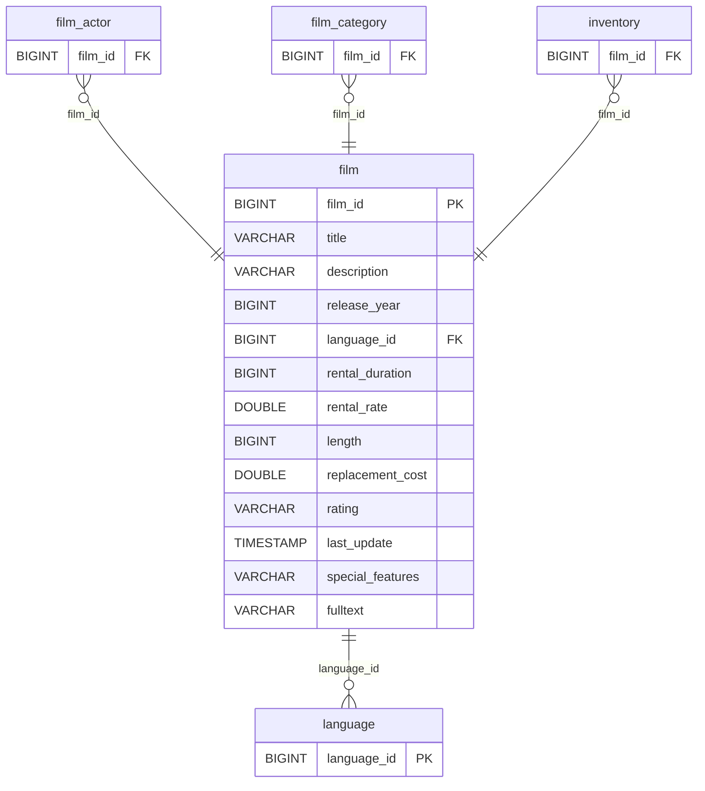

# Discovery Analysis — `film`
**Domain:** dvd_rentals
**Generated at:** 2026-05-16

---

## Overview

| Property  | Value  |
|-----------|--------|
| Table     | `film` |
| Row Count | 1,000  |

---

## 1. Primary Key

| Column    | Type   | Distinct Count | Notes                       |
|-----------|--------|----------------|-----------------------------|
| `film_id` | BIGINT | 1,000          | Fully unique — confirmed PK |

✅ `film_id` is the Primary Key. Its distinct count matches the row count exactly.

> ℹ️ Note: `title` is also fully unique (1,000 distinct values), which could serve as a natural business key.

---

## 2. Foreign Keys

| Column        | References Table | References Column | Notes                                           |
|---------------|------------------|-------------------|-------------------------------------------------|
| `language_id` | `language`       | `language_id`     | Only value is `1` (English) — all 1,000 films   |

> ⚠️ Note: All films have `language_id = 1` (English). The `language` table has 6 entries, but no other language is used in the film catalog in this dataset.

---

## 3. Orchestration

| Column        | Type      | Observed Values                              |
|---------------|-----------|----------------------------------------------|
| `last_update` | TIMESTAMP | `2013-05-26 14:50:58.951000` (all 1,000 rows)|
| `release_year`| BIGINT    | `2006` (all 1,000 films — no variation)       |

**Strategy:** All films share the same `last_update` timestamp from 2013, consistent with a **bulk migration event**. All films were released in 2006 with no variation. No incremental update pattern is detectable.

> 📌 Hypothesis: Full-refresh catalogue table. Film metadata is relatively static. Safe to reload entirely on each run.

---

## 4. Relationships (ERD)

