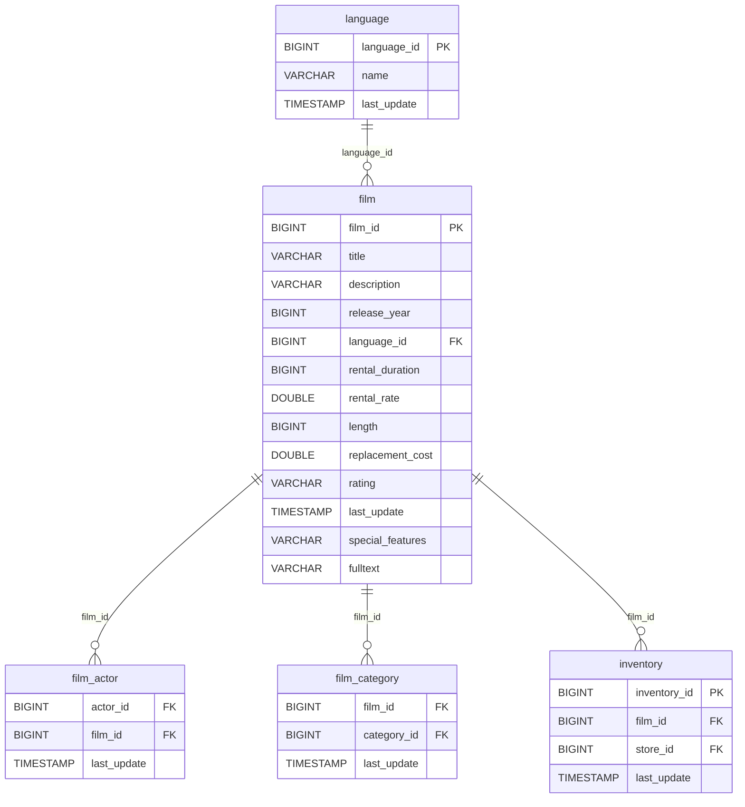

# 🎞️ Discovery Analysis — `film`
**Domain:** dvd_rentals
**Generated at:** 2026-05-16 20:59 UTC

---

## 1. Table Overview

| Property | Value |
|----------|-------|
| Table Name | `film` |
| Row Count | 1000 |
| Columns | 13 |

---

## 2. Primary Key

| Column | Type | Distinct Count | Rationale |
|--------|------|---------------|-----------|
| `film_id` | BIGINT | 1000 | Fully unique across all 1000 rows. Sequential integers 1–1000. Confirmed PK. |

> ℹ️ `title` also has 1000 distinct values and could serve as a natural key, but `film_id` is the surrogate PK.

---

## 3. Foreign Keys

| Column | Type | Distinct Count | References |
|--------|------|---------------|------------|
| `language_id` | BIGINT | 1 | → `language.language_id` — the language of the film. All 1000 films have `language_id = 1` (English), indicating no multi-language diversity in this snapshot. |

---

## 4. Orchestration

| Property | Detail |
|----------|--------|
| Update Timestamp Column | `last_update` |
| Latest Date Observed | `2013-05-26 14:50:58.951000` |
| Distinct Dates | 1 — all 1000 rows share the same timestamp |
| Strategy Hypothesis | **Static reference table — full-replace snapshot.** All films share an identical `last_update` and all have `release_year = 2006`. This strongly suggests a one-time bulk load. Likely refreshed full-replace on-demand or weekly. |

---

## 5. Relationships

### Outgoing FKs (from `film` to other tables)

| FK Column | References | Relationship |
|-----------|------------|--------------|
| `language_id` | `language.language_id` | Each film is produced in one language |

### Incoming FKs (other tables referencing `film`)

| Referencing Table | FK Column | Relationship |
|-------------------|-----------|--------------|
| `film_actor` | `film_id` | A film can feature many actors |
| `film_category` | `film_id` | A film belongs to one category |
| `inventory` | `film_id` | A film can have many inventory items |

---

## 6. Entity-Relationship Diagram

