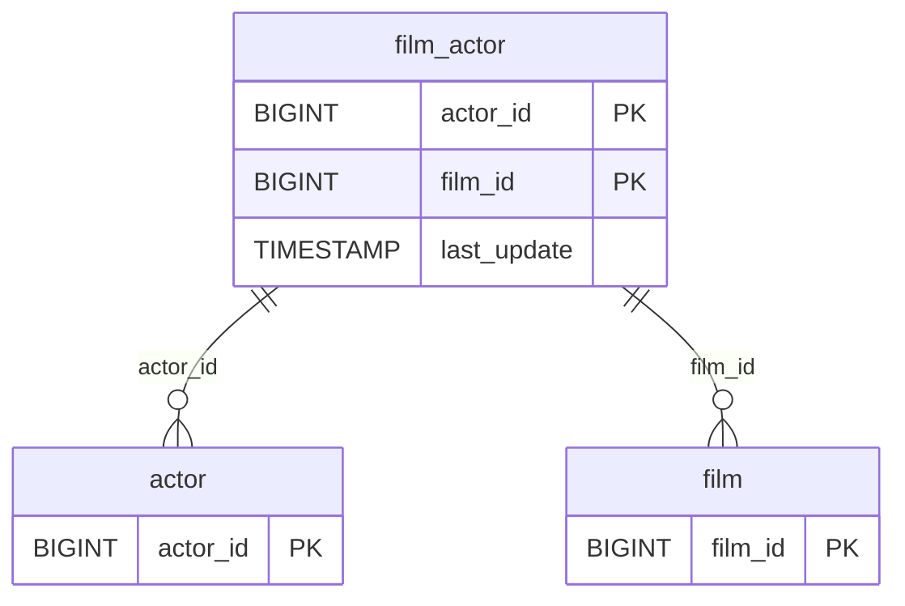

# Discovery Analysis — `film_actor`
**Domain:** dvd_rentals
**Generated at:** 2026-05-16

---

## Overview

| Property  | Value        |
|-----------|--------------|
| Table     | `film_actor` |
| Row Count | 5,462        |

---

## 1. Primary Key

No single-column PK detected. Analysis:

| Column     | Type   | Distinct Count | Notes                                           |
|------------|--------|----------------|-------------------------------------------------|
| `actor_id` | BIGINT | 200            | Not unique — each actor appears in many films   |
| `film_id`  | BIGINT | 997            | Not unique — each film has multiple actors      |

✅ **Composite PK: (`actor_id`, `film_id`)**. This is a many-to-many junction/bridge table. The combination of actor and film uniquely identifies each row. 3 films (997 vs 1000) have no actor associations.

---

## 2. Foreign Keys

| Column     | References Table | References Column | Notes                                       |
|------------|------------------|-------------------|---------------------------------------------|
| `actor_id` | `actor`          | `actor_id`        | 200 distinct values — all actors referenced |
| `film_id`  | `film`           | `film_id`         | 997 out of 1,000 films have actor mappings  |

---

## 3. Orchestration

| Column        | Type      | Observed Values                           |
|---------------|-----------|-------------------------------------------|
| `last_update` | TIMESTAMP | `2006-02-15 10:05:03` (all 5,462 rows)    |

**Strategy:** All rows share a single `last_update` timestamp, indicating a **static many-to-many bridge table** loaded once. No incremental updates expected.

> 📌 Hypothesis: Full-refresh bridge table. Maps actors to films — relatively static catalogue data. Safe to reload entirely on each run.

---

## 4. Relationships (ERD)

