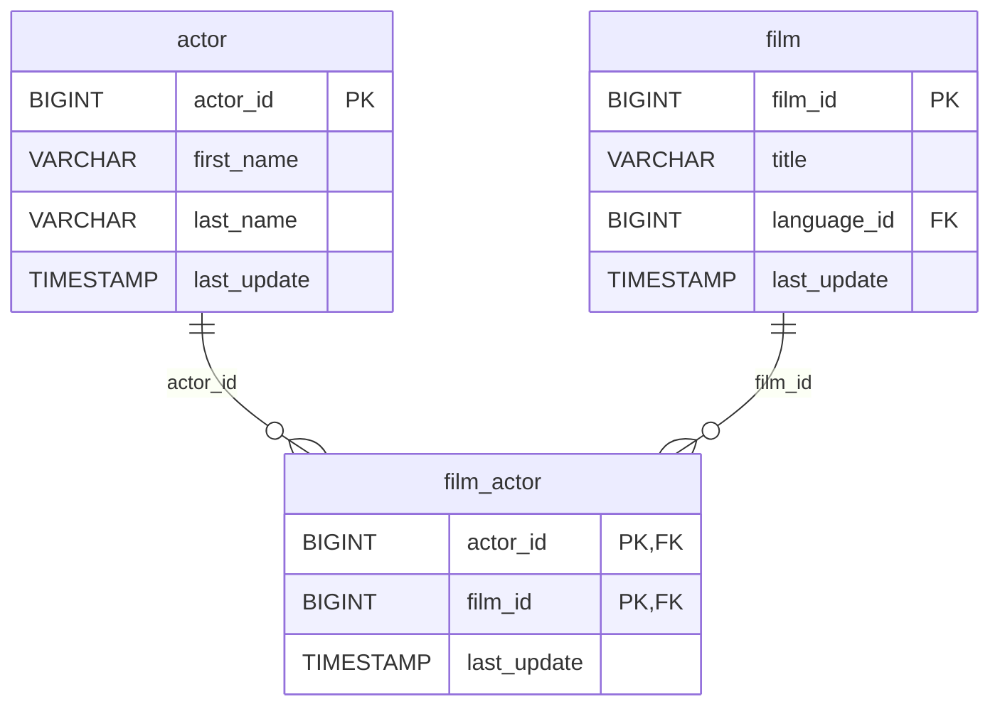

# 🎭 Discovery Analysis — `film_actor`
**Domain:** dvd_rentals
**Generated at:** 2026-05-16 20:59 UTC

---

## 1. Table Overview

| Property | Value |
|----------|-------|
| Table Name | `film_actor` |
| Row Count | 5,462 |
| Columns | 3 |

---

## 2. Primary Key

| Column | Type | Distinct Count | Rationale |
|--------|------|---------------|-----------|
| `(actor_id, film_id)` | BIGINT, BIGINT | — | **Composite PK hypothesis.** There is no single surrogate key column. `actor_id` has 200 distinct values (matching the `actor` table); `film_id` has 997 distinct values (out of 1000 films). The combination of both is required to uniquely identify a row — one actor appears in many films and one film features many actors. |

> ℹ️ This is a **bridge/junction table** implementing a many-to-many relationship between `actor` and `film`.

---

## 3. Foreign Keys

| Column | Type | Distinct Count | References |
|--------|------|---------------|------------|
| `actor_id` | BIGINT | 200 | → `actor.actor_id` — the actor appearing in the film |
| `film_id` | BIGINT | 997 | → `film.film_id` — the film featuring the actor |

---

## 4. Orchestration

| Property | Detail |
|----------|--------|
| Update Timestamp Column | `last_update` |
| Latest Date Observed | `2006-02-15 10:05:03` |
| Distinct Dates | 1 — all 5,462 rows share the same timestamp |
| Strategy Hypothesis | **Static bridge table — full-replace snapshot.** Uniform `last_update` across all rows indicates a single bulk load. No incremental pattern detectable. Likely refreshed in sync with `film` and `actor` tables on-demand or full-replace on a low cadence. |

---

## 5. Relationships

### Outgoing FKs (from `film_actor` to other tables)

| FK Column | References | Relationship |
|-----------|------------|--------------|
| `actor_id` | `actor.actor_id` | Links an actor to a film |
| `film_id` | `film.film_id` | Links a film to an actor |

### Incoming FKs
_None. This is a junction/bridge table._

---

## 6. Entity-Relationship Diagram

