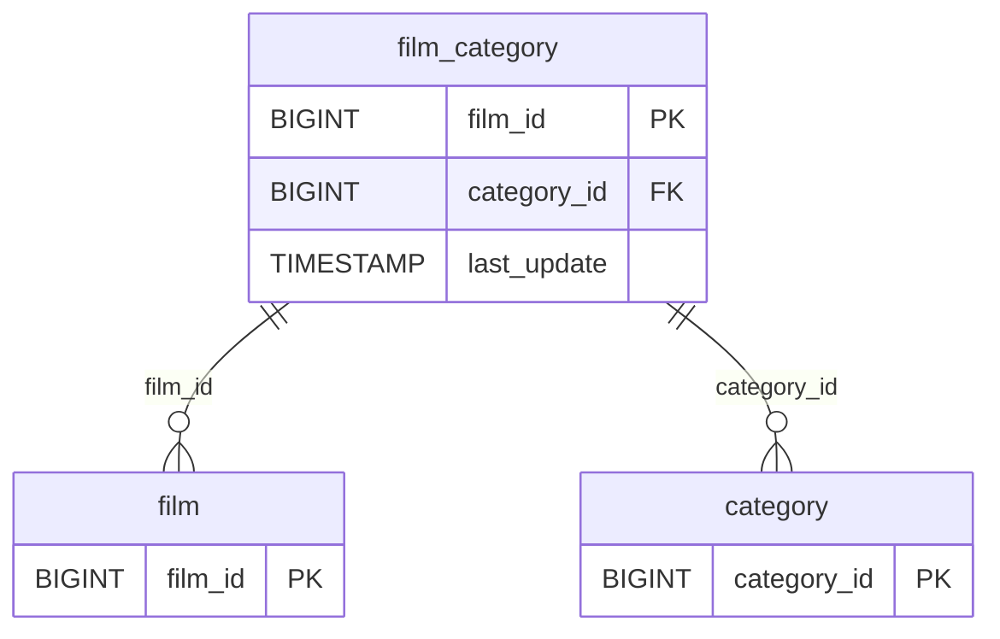

# Discovery Analysis — `film_category`
**Domain:** dvd_rentals
**Generated at:** 2026-05-16

---

## Overview

| Property  | Value           |
|-----------|-----------------|
| Table     | `film_category` |
| Row Count | 1,000           |

---

## 1. Primary Key

No single-column PK detected. Analysis:

| Column        | Type   | Distinct Count | Notes                                      |
|---------------|--------|----------------|--------------------------------------------|
| `film_id`     | BIGINT | 1,000          | Unique per row — each film has one category|
| `category_id` | BIGINT | 16             | 16 categories — not unique on its own      |

✅ **Composite PK hypothesis: (`film_id`, `category_id`)**. Since each film appears exactly once and maps to one category, `film_id` alone is unique in this table, but the semantic PK of this bridge/junction table is the combination of both columns.

---

## 2. Foreign Keys

| Column        | References Table | References Column | Notes                               |
|---------------|------------------|-------------------|-------------------------------------|
| `film_id`     | `film`           | `film_id`         | 1,000 distinct values — full film set|
| `category_id` | `category`       | `category_id`     | 16 distinct values [1–16]           |

---

## 3. Orchestration

| Column        | Type      | Observed Values                           |
|---------------|-----------|-------------------------------------------|
| `last_update` | TIMESTAMP | `2006-02-15 10:07:09` (all 1,000 rows)    |

**Strategy:** All rows share a single `last_update` timestamp, indicating a **static mapping/bridge table** loaded once. No incremental updates expected.

> 📌 Hypothesis: Full-refresh bridge table. Maps films to their genres — relatively static. Safe to reload entirely on each run.

---

## 4. Relationships (ERD)

