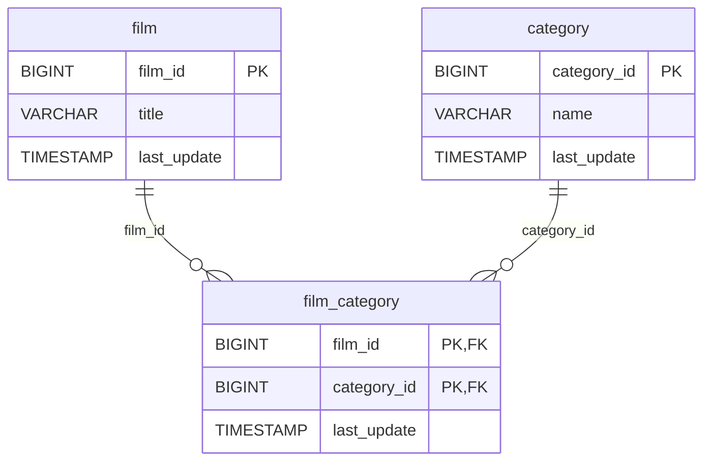

# 🗂️ Discovery Analysis — `film_category`
**Domain:** dvd_rentals
**Generated at:** 2026-05-16 20:59 UTC

---

## 1. Table Overview

| Property | Value |
|----------|-------|
| Table Name | `film_category` |
| Row Count | 1,000 |
| Columns | 3 |

---

## 2. Primary Key

| Column | Type | Distinct Count | Rationale |
|--------|------|---------------|-----------|
| `(film_id, category_id)` | BIGINT, BIGINT | — | **Composite PK hypothesis.** There is no surrogate key. `film_id` has 1,000 distinct values (exactly matching the `film` table row count — each film appears exactly once). `category_id` has 16 distinct values (matching the `category` table). Since `film_id` alone is fully unique across 1,000 rows, the table enforces a **one-category-per-film** constraint. The composite `(film_id, category_id)` is the natural key. |

> ℹ️ This is a **bridge/junction table** between `film` and `category`, though functionally it operates as a 1-to-1 assignment of category per film.

---

## 3. Foreign Keys

| Column | Type | Distinct Count | References |
|--------|------|---------------|------------|
| `film_id` | BIGINT | 1000 | → `film.film_id` — the film being categorised |
| `category_id` | BIGINT | 16 | → `category.category_id` — the genre/category assigned |

---

## 4. Orchestration

| Property | Detail |
|----------|--------|
| Update Timestamp Column | `last_update` |
| Latest Date Observed | `2006-02-15 10:07:09` |
| Distinct Dates | 1 — all 1,000 rows share the same timestamp |
| Strategy Hypothesis | **Static bridge table — full-replace snapshot.** Single uniform `last_update` across all rows. Refreshed in sync with `film` and `category` on-demand or full-replace on low cadence. |

---

## 5. Relationships

### Outgoing FKs (from `film_category` to other tables)

| FK Column | References | Relationship |
|-----------|------------|--------------|
| `film_id` | `film.film_id` | Each entry links a film to a category |
| `category_id` | `category.category_id` | Each entry assigns one category to a film |

### Incoming FKs
_None. This is a junction/bridge table._

---

## 6. Entity-Relationship Diagram

