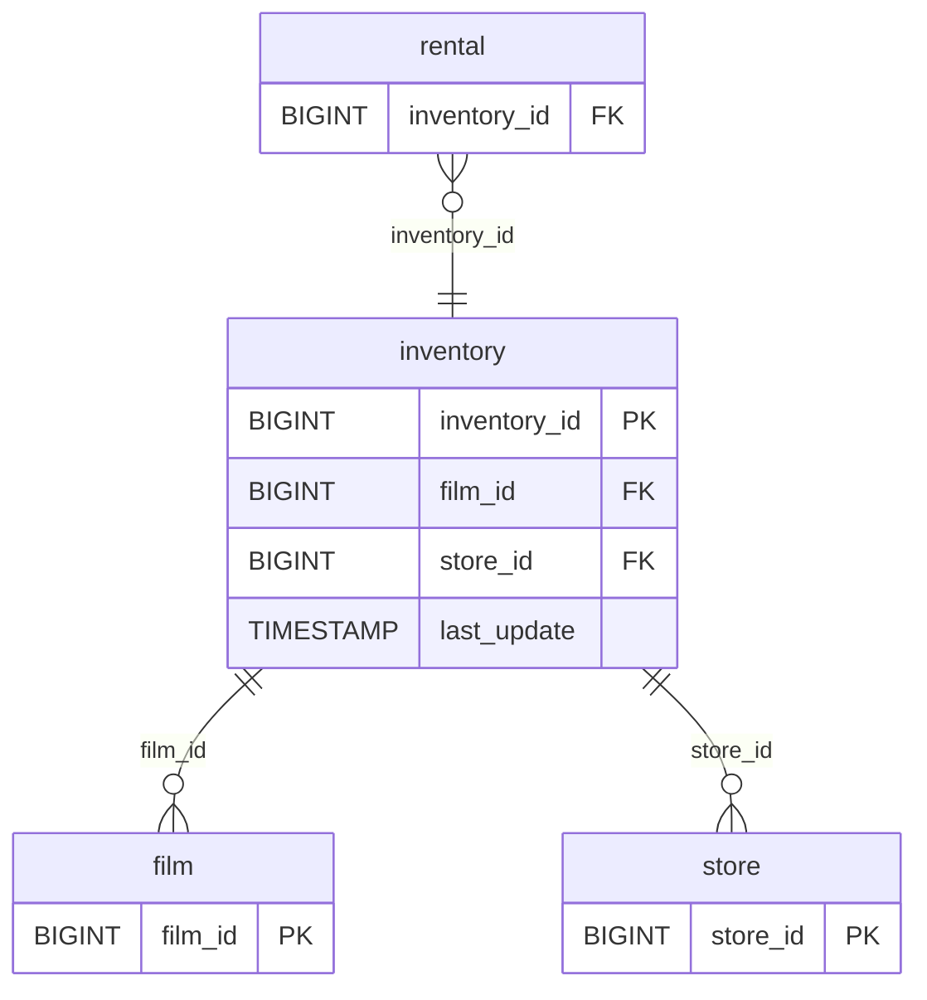

# Discovery Analysis — `inventory`
**Domain:** dvd_rentals
**Generated at:** 2026-05-16

---

## Overview

| Property  | Value       |
|-----------|-------------|
| Table     | `inventory` |
| Row Count | 4,581       |

---

## 1. Primary Key

| Column         | Type   | Distinct Count | Notes                       |
|----------------|--------|----------------|-----------------------------|
| `inventory_id` | BIGINT | 4,581          | Fully unique — confirmed PK |

✅ `inventory_id` is the Primary Key. Its distinct count matches the row count exactly.

> ℹ️ Note: This table represents **physical copies** of films held in stores. The same `film_id` can appear multiple times (958 distinct films → 4,581 inventory rows), meaning multiple copies per film.

---

## 2. Foreign Keys

| Column     | References Table | References Column | Notes                                          |
|------------|------------------|-------------------|------------------------------------------------|
| `film_id`  | `film`           | `film_id`         | 958 distinct films out of 1,000 — 42 films not stocked |
| `store_id` | `store`          | `store_id`        | Values [1, 2] — inventory split across 2 stores|

---

## 3. Orchestration

| Column        | Type      | Observed Values                           |
|---------------|-----------|-------------------------------------------|
| `last_update` | TIMESTAMP | `2006-02-15 10:09:17` (all 4,581 rows)    |

**Strategy:** All rows share a single `last_update` timestamp, indicating a **static operational table** loaded once. No incremental updates are evident from the current snapshot.

> 📌 Hypothesis: Full-refresh table. Represents the stock of physical DVD copies per store. Could occasionally change when new copies are acquired or retired, but current evidence suggests a one-time bulk load.

---

## 4. Relationships (ERD)

