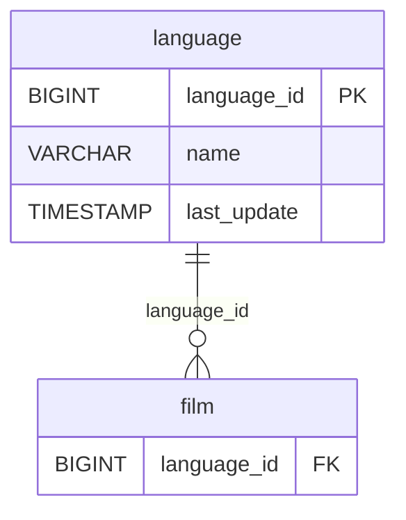

# Discovery Analysis — `language`
**Domain:** dvd_rentals
**Generated at:** 2026-05-16

---

## Overview

| Property  | Value      |
|-----------|------------|
| Table     | `language` |
| Row Count | 6          |

---

## 1. Primary Key

| Column        | Type   | Distinct Count | Notes                       |
|---------------|--------|----------------|-----------------------------|
| `language_id` | BIGINT | 6              | Fully unique — confirmed PK |

✅ `language_id` is the Primary Key. Its distinct count matches the row count exactly.

**Values:** English, French, Italian, German, Japanese, Mandarin.

---

## 2. Foreign Keys

No foreign key columns detected in this table.

---

## 3. Orchestration

| Column        | Type      | Observed Values              |
|---------------|-----------|------------------------------|
| `last_update` | TIMESTAMP | `2006-02-15 10:02:19` (all 6 rows) |

**Strategy:** All rows share a single `last_update` timestamp, indicating a **static reference/lookup table** loaded once via full-refresh. No incremental updates are expected.

> 📌 Hypothesis: Full-refresh reference table. Rarely changes. Can be reloaded in full on each pipeline run.

---

## 4. Relationships (ERD)

