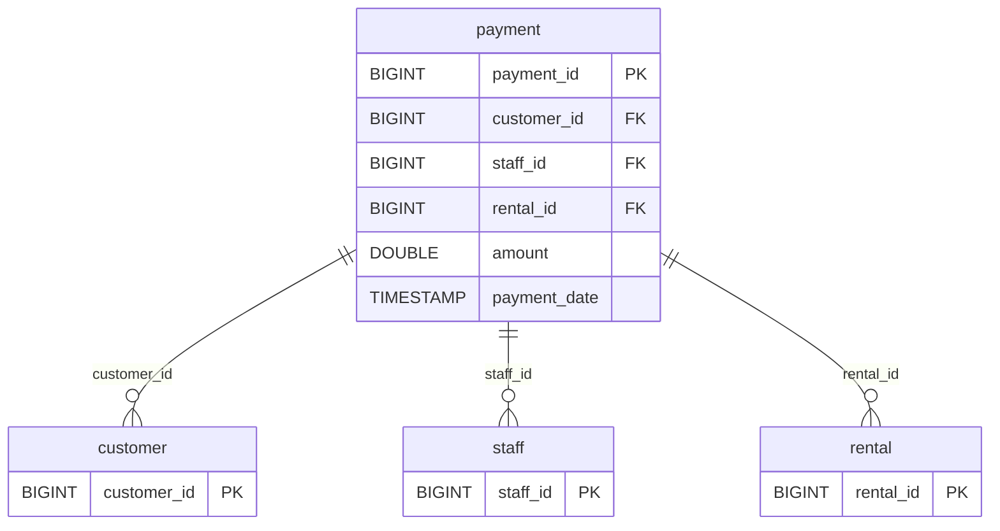

# Discovery Analysis — `payment`
**Domain:** dvd_rentals
**Generated at:** 2026-05-16

---

## Overview

| Property  | Value     |
|-----------|-----------|
| Table     | `payment` |
| Row Count | 14,596    |

---

## 1. Primary Key

| Column       | Type   | Distinct Count | Notes                       |
|--------------|--------|----------------|-----------------------------|
| `payment_id` | BIGINT | 14,596         | Fully unique — confirmed PK |

✅ `payment_id` is the Primary Key. Its distinct count matches the row count exactly.

> ℹ️ Note: `payment_id` ranges from 17,503 to 32,098, suggesting this table may be a subset or continuation of a larger payments ledger.

---

## 2. Foreign Keys

| Column        | References Table | References Column | Notes                                        |
|---------------|------------------|-------------------|----------------------------------------------|
| `customer_id` | `customer`       | `customer_id`     | 599 distinct values — all customers covered  |
| `staff_id`    | `staff`          | `staff_id`        | Values [1, 2] only                           |
| `rental_id`   | `rental`         | `rental_id`       | 14,592 distinct values out of 14,596 rows    |

> ⚠️ Note: `rental_id` is almost unique per payment (4 duplicates), suggesting most rentals have exactly one associated payment. 4 rentals may have been charged twice (potential data quality issue to monitor).

---

## 3. Orchestration

| Column          | Type      | Observed Values                                    |
|-----------------|-----------|----------------------------------------------------|
| `payment_date`  | TIMESTAMP | Ranges across 2007, with top value `2007-05-14` (182 rows)|

> ⚠️ Note: Unlike most other tables in the domain (2005–2006 data), payments are dated **2007**, suggesting a possible data refresh or migration event. No `last_update` column exists in `payment`.

**Strategy:** The `payment_date` column acts as the operational timestamp. The absence of a `last_update` column and the high cardinality (14,365 distinct timestamps) suggest this is an **append-only transactional table**. New payments would be inserted over time.

> 📌 Hypothesis: Incremental source — new payment records are appended over time. Pipeline should use `payment_date` as the watermark column to load only new records since the last run.

---

## 4. Relationships (ERD)

