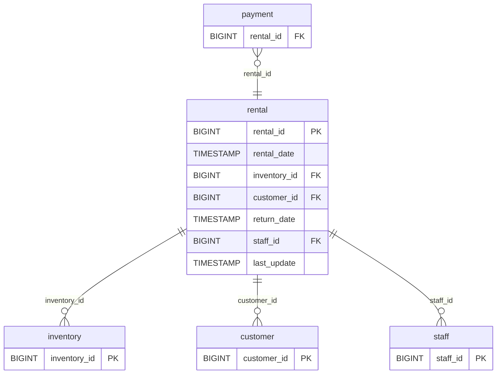

# Discovery Analysis — `rental`
**Domain:** dvd_rentals
**Generated at:** 2026-05-16

---

## Overview

| Property     | Value      |
|--------------|------------|
| Table        | `rental`   |
| Row Count    | 16,044     |

---

## 1. Primary Key

| Column      | Type    | Distinct Count | Notes                         |
|-------------|---------|----------------|-------------------------------|
| `rental_id` | BIGINT  | 16,044         | Fully unique — confirmed PK   |

✅ `rental_id` is the Primary Key. Its distinct count matches the row count exactly.

---

## 2. Foreign Keys

| Column         | References Table | References Column | Notes                              |
|----------------|------------------|-------------------|------------------------------------|
| `inventory_id` | `inventory`      | `inventory_id`    | 4,580 distinct values out of 4,581 |
| `customer_id`  | `customer`       | `customer_id`     | 599 distinct values — full coverage|
| `staff_id`     | `staff`          | `staff_id`        | Only 2 distinct values: [1, 2]     |

---

## 3. Orchestration

| Column        | Type      | Observed Values                                                                              |
|---------------|-----------|----------------------------------------------------------------------------------------------|
| `last_update` | TIMESTAMP | `2006-02-16 02:30:53` (16,042 rows), `2006-02-23 09:12:08`, `2006-02-15 21:30:53`           |
| `rental_date` | TIMESTAMP | Active period ranging across 2005–2006, with 15,815 distinct timestamps                      |
| `return_date` | TIMESTAMP | 183 records with null return_date (likely active/unreturned rentals)                         |

**Strategy:** The `last_update` column shows only 3 distinct timestamps, with 16,042 rows sharing the same value (`2006-02-16 02:30:53`). This suggests an **initial bulk load** followed by sparse manual updates. No evidence of a recurring incremental refresh pattern.

> 📌 Hypothesis: Full-refresh source table, loaded once. Incremental strategy may apply if the pipeline tracks `last_update` or `rental_date` as a watermark.

---

## 4. Relationships (ERD)

