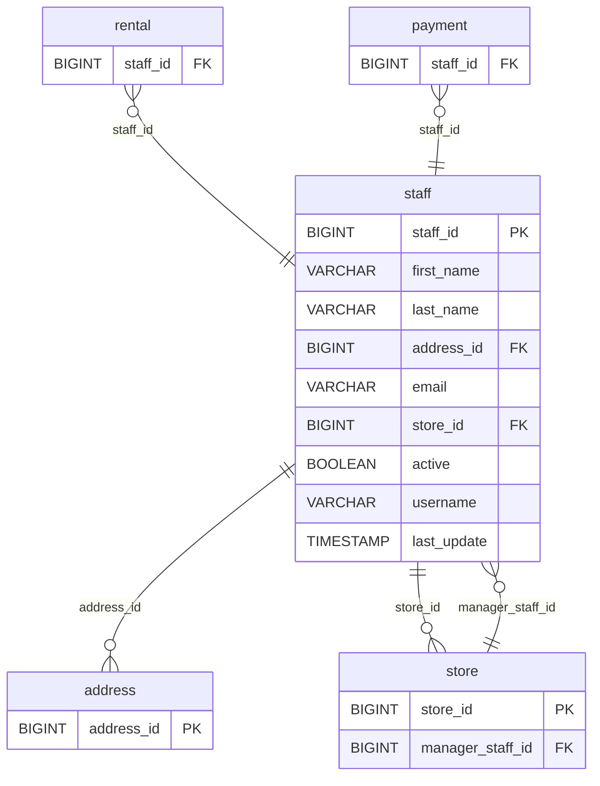

# Discovery Analysis — `staff`
**Domain:** dvd_rentals
**Generated at:** 2026-05-16

---

## Overview

| Property  | Value   |
|-----------|---------|
| Table     | `staff` |
| Row Count | 2       |

---

## 1. Primary Key

| Column     | Type   | Distinct Count | Notes                       |
|------------|--------|----------------|-----------------------------|
| `staff_id` | BIGINT | 2              | Fully unique — confirmed PK |

✅ `staff_id` is the Primary Key. Two staff members: Mike Hillyer (ID 1) and Jon Stephens (ID 2).

---

## 2. Foreign Keys

| Column       | References Table | References Column | Notes                                 |
|--------------|------------------|-------------------|---------------------------------------|
| `address_id` | `address`        | `address_id`      | Values [3, 4] — unique per staff member|
| `store_id`   | `store`          | `store_id`        | Values [1, 2] — one store each        |

---

## 3. Orchestration

| Column        | Type      | Observed Values                     |
|---------------|-----------|-------------------------------------|
| `last_update` | TIMESTAMP | `2006-05-16 16:13:11.793280` (both rows) |

**Strategy:** All rows share a single `last_update` timestamp. This is a **small, near-static operational table** representing the rental store's employees. Expected to be loaded via **full-refresh**.

> 📌 Hypothesis: Full-refresh table. Very low cardinality — no evidence of frequent changes. Safe to reload entirely on each run.

---

## 4. Relationships (ERD)

