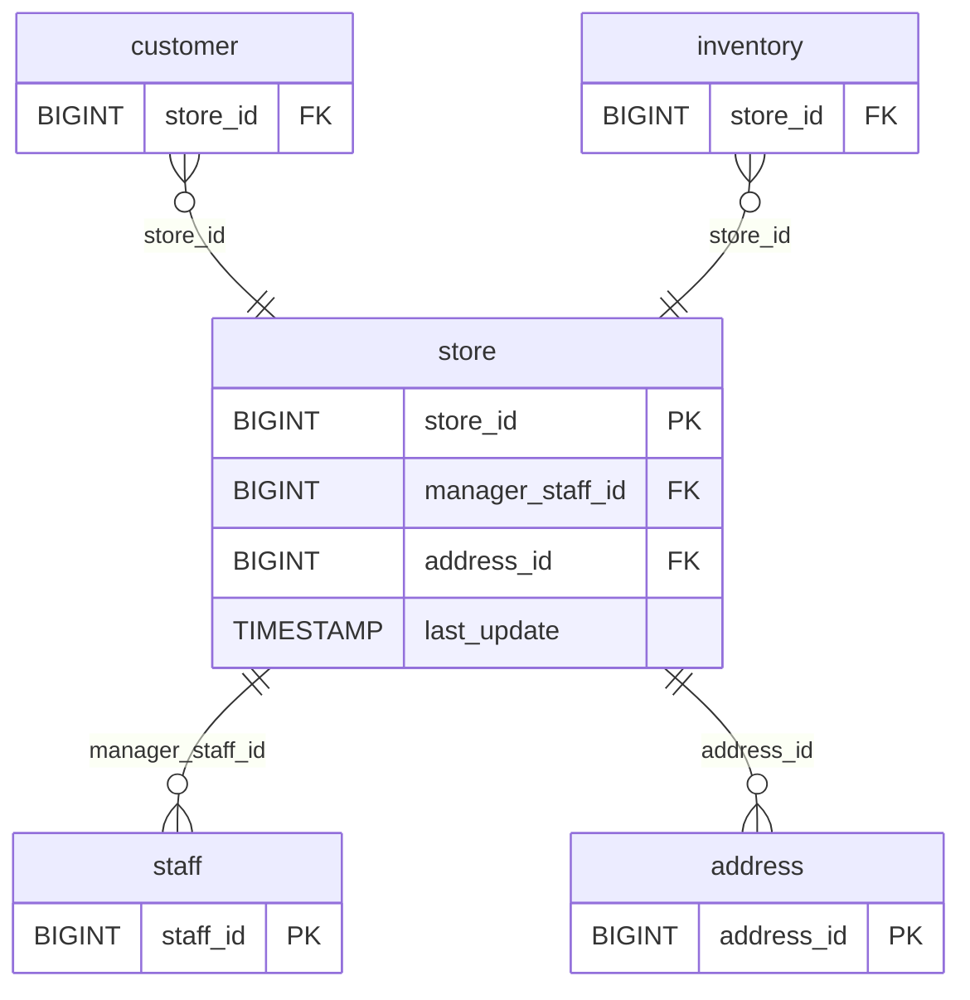

# Discovery Analysis — `store`
**Domain:** dvd_rentals
**Generated at:** 2026-05-16

---

## Overview

| Property  | Value   |
|-----------|---------|
| Table     | `store` |
| Row Count | 2       |

---

## 1. Primary Key

| Column     | Type   | Distinct Count | Notes                       |
|------------|--------|----------------|-----------------------------|
| `store_id` | BIGINT | 2              | Fully unique — confirmed PK |

✅ `store_id` is the Primary Key. Two stores exist: IDs 1 and 2.

---

## 2. Foreign Keys

| Column            | References Table | References Column | Notes                           |
|-------------------|------------------|-------------------|---------------------------------|
| `manager_staff_id`| `staff`          | `staff_id`        | Values [1, 2] — one manager each|
| `address_id`      | `address`        | `address_id`      | Values [1, 2] — one address each|

---

## 3. Orchestration

| Column        | Type      | Observed Values              |
|---------------|-----------|------------------------------|
| `last_update` | TIMESTAMP | `2006-02-15 09:57:12` (both rows) |

**Strategy:** Both rows share a single `last_update` timestamp. This is a **very small, static reference table** with 2 records representing physical store locations. It is expected to be loaded via **full-refresh**.

> 📌 Hypothesis: Full-refresh reference table. Extremely low cardinality — safe to reload entirely on each run.

---

## 4. Relationships (ERD)

