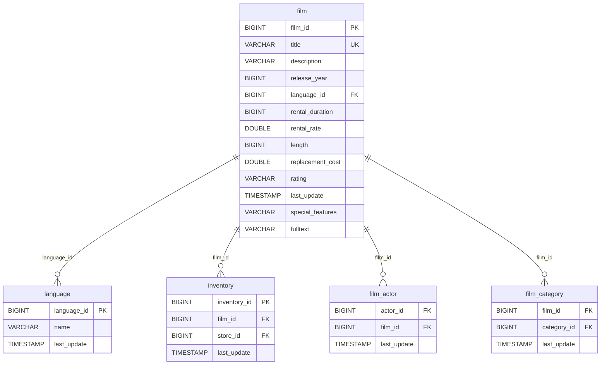

# Data Architecture Discovery: film

**Analysis Date:** 2025-01-16  
**Domain:** dvd_rentals  
**Row Count:** 1,000

---

## 1. Primary Key Analysis

**Primary Key:** `film_id`

**Justification:**
- Column `film_id` has 1,000 distinct values matching the total row count (1,000)
- All values are unique (distinct_count = row_count)
- Sequential numeric identifier (BIGINT: 1 to 1,000)
- Represents unique film titles in catalog

**Uniqueness Confidence:** ✅ High (100% unique)

**Alternative Unique Key:** `title` also has 1,000 distinct values (100% unique)

---

## 2. Foreign Key Analysis

The `film` table contains the following foreign key relationships:

| FK Column | References Table | References Column | Cardinality |
|-----------|------------------|-------------------|-------------|
| `language_id` | language | language_id | Many-to-One |

**Details:**
- **language_id**: Only 1 distinct value (1) - all films are in English
- This foreign key has low cardinality but maintains referential integrity

---

## 3. Orchestration Strategy

**Update Timestamp Column:** `last_update`

**Latest Dates (Top 10):**
- "2013-05-26 14:50:58.951000" (all 1,000 records)

**Derived Orchestration Strategy:**
> A dimension table materialized with full-refresh strategy. All records share the same `last_update` timestamp, indicating a bulk update or data migration. The uniform `release_year` (all 2006) and static timestamp suggest this is a reference/catalog table that changes infrequently. This is a slowly changing dimension.

**Refresh Strategy:** Full refresh or SCD Type 1 merge based on `film_id`

**Refresh Latency:** Infrequent updates (weekly/monthly) - catalog changes slowly

---

## 4. Entity Relationship Diagram

---

## 5. Business Context

**Table Purpose:** Core product dimension containing film catalog information

**Key Metrics:**
- Total films in catalog: 1,000
- Release year: All films from 2006
- Language: All films in English (language_id = 1)
- Average rental duration: 5.0 days
- Average rental rate: $2.98
- Average film length: 115.3 minutes
- Average replacement cost: $19.98

**Rental Rate Distribution:**
- $0.99: Budget tier
- $2.99: Standard tier (most common)
- $4.99: Premium tier

**Rating Distribution:**
- PG-13: 223 films (22.3%)
- NC-17: Significant portion
- R, PG, G: Various distributions
- 5 distinct ratings covering all audience types

**Special Features:**
- 15 distinct combinations of features
- Most common: Trailers + Commentaries + Behind the Scenes (79 films)
- Features include: Trailers, Commentaries, Deleted Scenes, Behind the Scenes

---

## 6. Data Quality Observations

✅ **Strengths:**
- Strong primary key integrity (100% unique)
- Title uniqueness maintained (no duplicate titles)
- Complete film metadata (descriptions, ratings, features)
- Consistent data types and value ranges

⚠️ **Potential Issues:**
- All films in single language (language_id = 1) - FK relationship underutilized
- Uniform release_year (2006) and last_update timestamp suggest static dataset
- Film length varies widely (46-185 minutes) - validate for outliers

📊 **Statistical Insights:**
- Rental duration: 3-7 days (std: 1.41)
- Rental rate: $0.99-$4.99 (std: $1.65)
- Film length: 46-185 minutes (std: 40.4 minutes)
- Replacement cost: $9.99-$29.99 (std: $6.05)

---

## 7. Recommendations

1. **Data Modeling:** 
   - Core product dimension in star schema
   - Consider as Type 2 SCD to track price/rate changes over time
   - Use film_id as surrogate key, title as natural key

2. **Loading Strategy:** 
   - Full refresh acceptable given size and update frequency
   - Consider incremental if catalog grows significantly
   - Track changes in rental_rate and rental_duration for pricing analysis

3. **Data Quality:**
   - Add data validation for film length (flag outliers)
   - Consider adding original_language_id to track dubbed versions
   - Validate replacement_cost is always >= rental_rate

4. **Analytics:**
   - Film performance analysis (revenue by rating, length, features)
   - Pricing optimization (rental rate vs demand)
   - Category analysis (via film_category bridge table)
   - Actor popularity (via film_actor bridge table)

5. **Performance:** 
   - Index on `title` for title-based searches
   - Consider partitioning by `category` if table grows
   - Full-text search on `fulltext` column for content-based discovery

6. **Business Intelligence:**
   - Track rental performance by rating tier
   - Analyze impact of special features on rentals
   - Monitor replacement cost vs actual damages/losses
