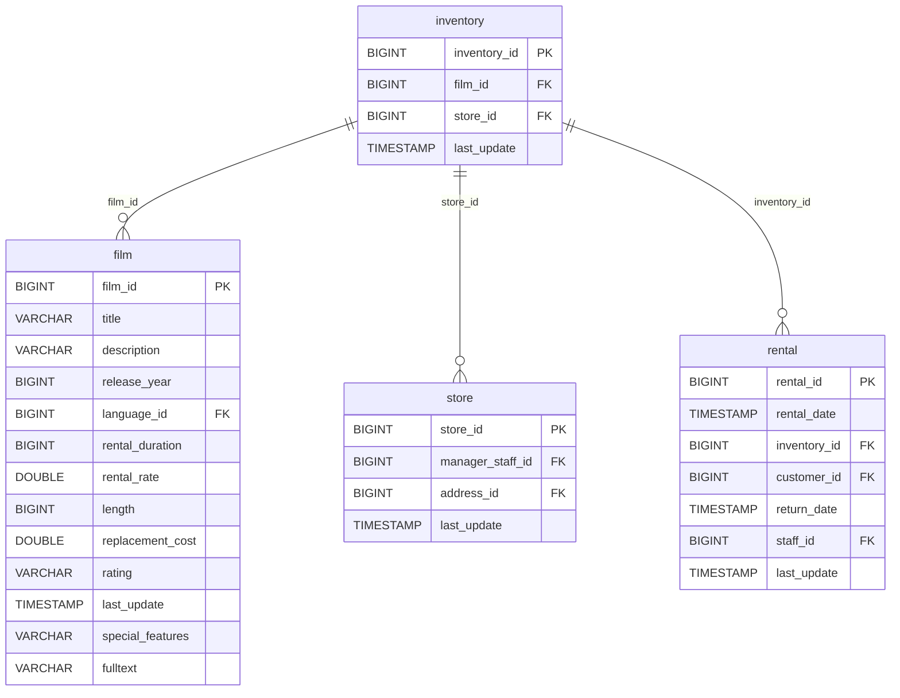

# Data Architecture Discovery: inventory

**Analysis Date:** 2025-01-16  
**Domain:** dvd_rentals  
**Row Count:** 4,581

---

## 1. Primary Key Analysis

**Primary Key:** `inventory_id`

**Justification:**
- Column `inventory_id` has 4,581 distinct values matching the total row count (4,581)
- All values are unique (distinct_count = row_count)
- Sequential numeric identifier (BIGINT: 1 to 4,581)
- Represents individual physical copies of films

**Uniqueness Confidence:** ✅ High (100% unique)

---

## 2. Foreign Key Analysis

The `inventory` table contains the following foreign key relationships:

| FK Column | References Table | References Column | Cardinality |
|-----------|------------------|-------------------|-------------|
| `film_id` | film | film_id | Many-to-One |
| `store_id` | store | store_id | Many-to-One |

**Details:**
- **film_id**: 958 distinct values - indicates which film this inventory item represents (multiple copies per film)
- **store_id**: 2 distinct values (1, 2) - indicates which store location holds this inventory

---

## 3. Orchestration Strategy

**Update Timestamp Column:** `last_update`

**Latest Dates (Top 10):**
- "2006-02-15 10:09:17" (all 4,581 records)

**Derived Orchestration Strategy:**
> A source materialized as table, full-refresh every run. All records share the same `last_update` timestamp, indicating a snapshot-based refresh pattern rather than incremental updates. This is a static reference table representing physical inventory items.

**Refresh Strategy:** Full refresh/snapshot

**Refresh Latency:** Periodic batch (likely daily or less frequent, as inventory changes are infrequent)

---

## 4. Entity Relationship Diagram

---

## 5. Business Context

**Table Purpose:** Bridge table between films and physical inventory copies, tracking which store has which film copies

**Key Metrics:**
- Total inventory items: 4,581
- Unique films in inventory: 958 (out of 1,000 total films)
- Average copies per film: ~4.8
- Distribution across stores: ~50/50 (mean store_id: 1.50)

**Inventory Distribution:**
- Store 1: ~2,273 items (49.6%)
- Store 2: ~2,308 items (50.4%)

---

## 6. Data Quality Observations

✅ **Strengths:**
- Strong primary key integrity (100% unique)
- Clean foreign key relationships
- Balanced inventory distribution across stores

⚠️ **Potential Issues:**
- 42 films (1,000 - 958) are not represented in inventory - potentially out of stock or not yet available
- Static timestamp suggests no real-time inventory tracking

---

## 7. Recommendations

1. **Data Modeling:** Use as bridge/dimension table in dimensional model
2. **Loading Strategy:** Full refresh acceptable given small size and infrequent changes
3. **Analytics:** Track inventory turnover by joining with rental facts
4. **Inventory Management:** Identify films with insufficient copies based on rental demand
5. **Performance:** Index on `film_id` and `store_id` for join optimization
