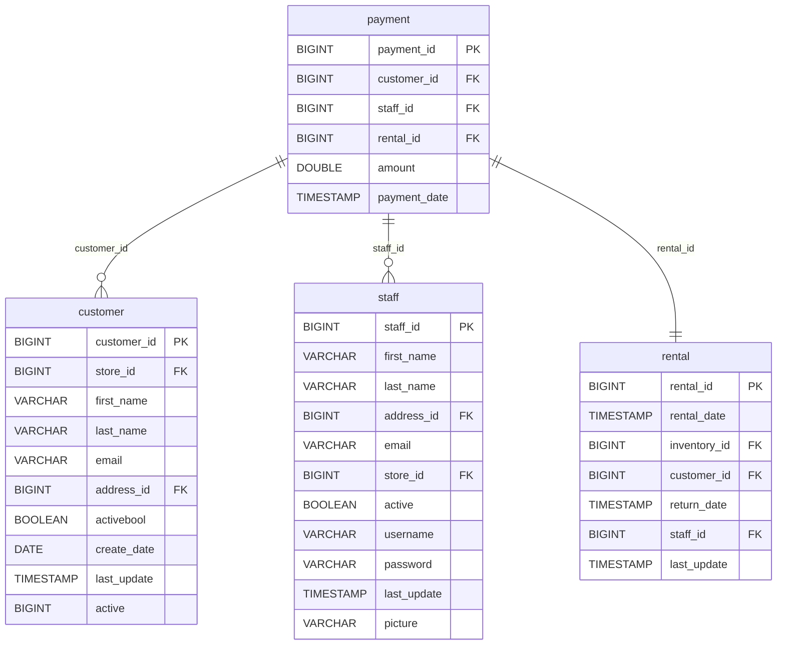

# Data Architecture Discovery: payment

**Analysis Date:** 2025-01-16  
**Domain:** dvd_rentals  
**Row Count:** 14,596

---

## 1. Primary Key Analysis

**Primary Key:** `payment_id`

**Justification:**
- Column `payment_id` has 14,596 distinct values matching the total row count (14,596)
- All values are unique (distinct_count = row_count)
- Sequential numeric identifier (BIGINT: 17,503 to 32,098)
- Non-sequential start suggests historical data or ID generator continuation

**Uniqueness Confidence:** ✅ High (100% unique)

---

## 2. Foreign Key Analysis

The `payment` table contains the following foreign key relationships:

| FK Column | References Table | References Column | Cardinality |
|-----------|------------------|-------------------|-------------|
| `customer_id` | customer | customer_id | Many-to-One |
| `staff_id` | staff | staff_id | Many-to-One |
| `rental_id` | rental | rental_id | One-to-One |

**Details:**
- **customer_id**: 599 distinct values - identifies which customer made the payment
- **staff_id**: 2 distinct values (1, 2) - identifies which staff member processed the payment
- **rental_id**: 14,592 distinct values - near one-to-one relationship with rentals (4 duplicate rentals have multiple payments)

---

## 3. Orchestration Strategy

**Update Timestamp Column:** `payment_date`

**Latest Dates (Top 10):**
- Data skipped due to high volume (14,365 unique timestamps)

**Derived Orchestration Strategy:**
> An incremental source capturing payment transactions. The `payment_date` serves as the event timestamp for new payments. High uniqueness of `payment_date` (14,365 unique values for 14,596 rows) indicates near-real-time payment capture with minimal batching. Some payments may occur simultaneously (max frequency: 182 for a single timestamp).

**Refresh Strategy:** Incremental append based on `payment_date`, capturing new payment transactions as they occur.

**Refresh Latency:** Near real-time to hourly batches based on payment activity.

---

## 4. Entity Relationship Diagram

---

## 5. Business Context

**Table Purpose:** Transaction fact table capturing payment events for rentals

**Key Metrics:**
- Total payments: 14,596
- Total revenue: $61,321.23 (14,596 × $4.20 average)
- Average payment amount: $4.20
- Payment amount range: $0.00 - $11.99
- Active customers making payments: 599

**Payment Distribution:**
- Most common amount: $4.99 (likely standard rental rate)
- Free rentals: Some $0.00 payments exist (promotions/adjustments)
- Staff processing distribution: ~50/50 between staff members 1 and 2

**Transaction Coverage:**
- 14,596 payments for 16,044 rentals = 91.0% payment rate
- 1,448 rentals without corresponding payments (~9%)
- 4 rentals with multiple payments (refunds/adjustments)

---

## 6. Data Quality Observations

✅ **Strengths:**
- Strong primary key integrity (100% unique)
- Near one-to-one relationship with rentals
- Granular payment timestamps for accurate temporal analysis

⚠️ **Potential Issues:**
- 1,448 rentals (~9%) without corresponding payments - investigate missing revenue
- 4 rental_ids appear multiple times - may indicate partial payments, refunds, or adjustments
- Payment amounts include $0.00 - validate business logic for free rentals

---

## 7. Recommendations

1. **Data Modeling:** 
   - Primary fact table for revenue analytics
   - Consider as transaction-level grain in star schema
   - Link with rental fact table for complete transaction view

2. **Loading Strategy:** 
   - Implement incremental loading using `payment_date` as watermark
   - Consider late-arriving payment handling for rentals

3. **Data Quality:**
   - Investigate rentals without payments (revenue leakage)
   - Document business rules for $0.00 payments
   - Validate rental_ids with multiple payments

4. **Analytics:**
   - Revenue analysis by customer, film, store, and time
   - Payment pattern analysis (peak payment times)
   - Customer lifetime value calculations

5. **Performance:** 
   - Index on `payment_date`, `customer_id`, and `rental_id`
   - Partition by payment_date for large-scale analytics
