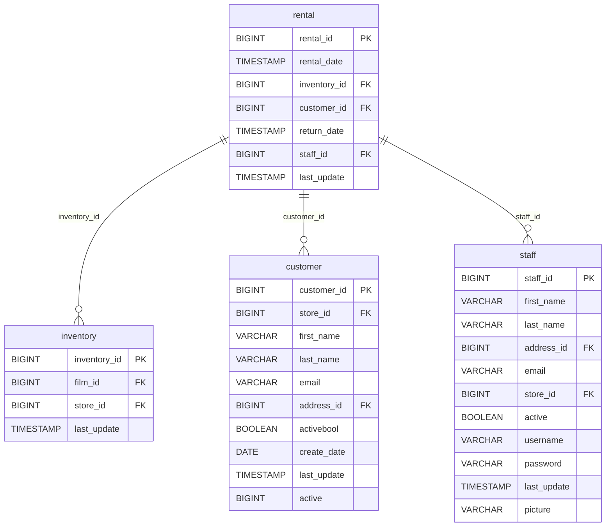

# Data Architecture Discovery: rental

**Analysis Date:** 2025-01-16  
**Domain:** dvd_rentals  
**Row Count:** 16,044

---

## 1. Primary Key Analysis

**Primary Key:** `rental_id`

**Justification:**
- Column `rental_id` has 16,044 distinct values matching the total row count (16,044)
- All values are unique (distinct_count = row_count)
- Sequential numeric identifier (BIGINT: 1 to 16,049)
- Non-nullable constraint expected for PK

**Uniqueness Confidence:** ✅ High (100% unique)

---

## 2. Foreign Key Analysis

The `rental` table contains the following foreign key relationships:

| FK Column | References Table | References Column | Cardinality |
|-----------|------------------|-------------------|-------------|
| `inventory_id` | inventory | inventory_id | Many-to-One |
| `customer_id` | customer | customer_id | Many-to-One |
| `staff_id` | staff | staff_id | Many-to-One |

**Details:**
- **inventory_id**: 4,580 distinct values - links to physical inventory items that are rented
- **customer_id**: 599 distinct values - identifies which customer made the rental
- **staff_id**: 2 distinct values (1, 2) - identifies which staff member processed the rental

---

## 3. Orchestration Strategy

**Update Timestamp Column:** `rental_date`

**Latest Dates (Top 10):**
- Data skipped due to high volume (15,815 unique timestamps)

**Additional Timestamps:**
- `return_date`: Tracks when items were returned (15,861 records with values)
- `last_update`: Static update timestamp ("2006-02-16 02:30:53" appears 16,042 times)

**Derived Orchestration Strategy:**
> An incremental source table that captures rental transactions. The `rental_date` serves as the event timestamp for new rentals. The high uniqueness of `rental_date` (15,815 unique values for 16,044 rows) suggests near-real-time or batched inserts. The `last_update` column indicates a batch update pattern with most records updated at the same time.

**Refresh Strategy:** Incremental append based on `rental_date`, capturing new rental transactions as they occur.

**Refresh Latency:** Near real-time to hourly batches based on rental activity.

---

## 4. Entity Relationship Diagram

---

## 5. Business Context

**Table Purpose:** Transaction fact table capturing DVD rental events

**Key Metrics:**
- Total rentals: 16,044
- Active customers: 599
- Average rentals per customer: ~26.8
- Return rate: 98.9% (15,861 returns out of 16,044 rentals)

**Temporal Coverage:** 
- Rental activity spans multiple dates with high granularity
- Most recent batch update: February 16, 2006

---

## 6. Data Quality Observations

✅ **Strengths:**
- Strong primary key integrity (100% unique)
- High return rate indicates good data completeness
- Clear foreign key relationships

⚠️ **Potential Issues:**
- 183 rentals missing return dates (~1.1%)
- Some `rental_date` values appear multiple times (max frequency: 182) - likely batch processing

---

## 7. Recommendations

1. **Data Modeling:** Use as primary fact table in rental analytics dimensional model
2. **Incremental Loading:** Implement incremental strategy using `rental_date` as watermark
3. **Data Quality:** Monitor rentals without return dates for potential issues
4. **Performance:** Index on `rental_date`, `customer_id`, and `inventory_id` for query optimization
